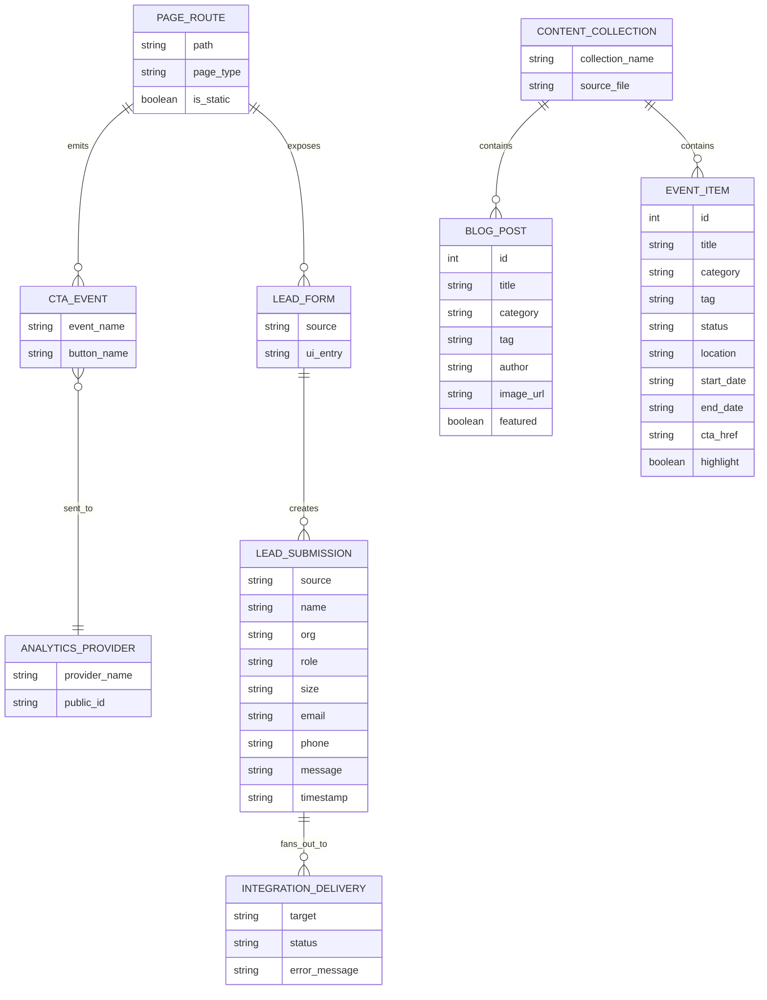

# Classin Home 구조 / 스키마 / ERD 정리

기준 시점: 2026-03-18

## 1. 한눈에 보기

- 이 프로젝트는 `Next.js 16 + React 19 + TypeScript + Tailwind CSS v4` 기반의 마케팅/도입 랜딩 사이트다.
- 데이터 저장용 ORM, DB 스키마, 마이그레이션 파일은 현재 저장소 안에 없다.
- 실제 런타임 데이터 흐름은 크게 두 갈래다.
  - 마케팅/콘텐츠 렌더링: 페이지 내부 하드코딩 배열과 섹션 컴포넌트 중심
  - 리드 수집: 폼 입력 → `/api/lead` → 외부 웹훅 3종 전송
- 따라서 아래 ERD는 “물리 DB ERD”가 아니라 현재 코드 기준의 “논리 ERD”다.

## 2. 기술 스택

| 영역 | 내용 |
| --- | --- |
| Framework | Next.js 16.1.4 (App Router) |
| UI | React 19.2.3 |
| Styling | Tailwind CSS v4, `app/globals.css` 커스텀 토큰 |
| Motion | Framer Motion |
| UI Primitive | Radix UI |
| Chart | Recharts |
| Analytics | Google Analytics, Meta Pixel, Kakao Pixel |
| Lead 전달 | Google Sheet Webhook, 일반 Webhook, ChannelTalk Webhook |

## 3. 디렉터리 구조

```text
app/
  layout.tsx                 전역 레이아웃
  page.tsx                   메인 랜딩 페이지
  api/lead/route.ts          리드 수집 API
  blog/page.tsx              블로그 목록
  contact/page.tsx           문의 페이지
  events/page.tsx            행사/프로모션 페이지
  pricing/page.tsx           요금 계산 페이지
  product/
    layout.tsx               제품 하위 탭 레이아웃
    page.tsx                 /product -> /product/sw 리다이렉트
    sw/page.tsx              소프트웨어 소개
    hw/page.tsx              하드웨어 소개

components/
  AnalyticsProviders.tsx     분석 스크립트 삽입
  sections/                  페이지 섹션 단위 컴포넌트
  ui/                        버튼, 카드, 다이얼로그 등 재사용 UI

lib/
  analytics.ts               이벤트 트래킹 헬퍼
  submitLead.ts              클라이언트 리드 제출 헬퍼
  utils.ts                   클래스 병합 유틸

public/
  images/                    로고, 썸네일, 대시보드 이미지 등 정적 자산
```

## 4. 라우트 구조

| 경로 | 성격 | 핵심 역할 | 파일 |
| --- | --- | --- | --- |
| `/` | 정적 | 메인 랜딩, 섹션 조합 | `app/page.tsx` |
| `/product` | 리다이렉트 | `/product/sw`로 이동 | `app/product/page.tsx` |
| `/product/sw` | 정적 | 소프트웨어 소개 | `app/product/sw/page.tsx` |
| `/product/hw` | 정적 | 하드웨어 소개 | `app/product/hw/page.tsx` |
| `/pricing` | 정적 | 요금 계산기 | `app/pricing/page.tsx` |
| `/blog` | 정적 | 블로그 목록/검색/뉴스레터 CTA | `app/blog/page.tsx` |
| `/events` | 정적 | 행사/프로모션 목록 | `app/events/page.tsx` |
| `/contact` | 정적 | 문의 폼 + 연락처 정보 | `app/contact/page.tsx` |
| `/api/lead` | 동적 | 리드 수집 및 외부 전송 | `app/api/lead/route.ts` |

빌드 기준 생성 라우트:

```text
/
/blog
/contact
/events
/pricing
/product
/product/hw
/product/sw
/api/lead
```

## 5. 렌더링 구조

### 5-1. 전역 레이아웃

`app/layout.tsx`

- `<Header />` 고정 렌더
- `<main>{children}</main>` 내부에 실제 페이지 렌더
- `<FloatingChatbot />` 전역 플로팅 배치
- `<AnalyticsProviders />` 전역 스크립트 삽입
- 현재 `<Footer />`는 컴포넌트는 존재하지만 전역 레이아웃에 연결되어 있지 않다

### 5-2. 메인 랜딩 페이지

`app/page.tsx`

- 초기 3개 섹션은 정적 import
  - `Hero`
  - `ProblemCost`
  - `BridgeMoment`
- 이후 섹션은 `next/dynamic`으로 지연 로드
  - `Outcomes`
  - `SolutionOverview`
  - `KeyUseCases`
  - `DashboardPreview`
  - `ScienceBased`
  - `SatisfyingClass`
  - `CaseStudies`
  - `Comparison`
  - `FAQ`
  - `FinalCTA`

### 5-3. 제품 섹션

`app/product/layout.tsx`

- 제품 하위 페이지에서 `ProductTabNav`를 공통 렌더
- 실제 내용은 `/product/sw`, `/product/hw`가 각각 담당

## 6. 데이터 구조

## 6-1. 실제 백엔드 계약: LeadPayload

출처: `app/api/lead/route.ts`

```ts
interface LeadPayload {
  source: "demo_modal" | "contact_page" | "newsletter"
  name?: string
  org?: string
  role?: string
  size?: string
  email?: string
  phone?: string
  message?: string
  timestamp: string
}
```

설명:

- `source`는 리드 유입 경로 식별자
- `timestamp`는 클라이언트가 보내지만 서버가 `new Date().toISOString()`으로 덮어쓴다
- 서버 단에서 필수 필드 검증은 없다
- 이 스키마를 `lib/submitLead.ts`가 타입으로 재사용한다

## 6-2. 분석 이벤트 스키마

출처: `lib/analytics.ts`

```ts
type EventNames =
  | "page_view"
  | "click_cta"
  | "submit_demo_request"
  | "download_materials"
  | "view_demo_video"
```

전송 대상:

- Google Analytics
- Meta Pixel
- Kakao Pixel

## 6-3. 정적 콘텐츠 스키마

### BlogPost

출처: `app/blog/page.tsx`

```ts
interface BlogPost {
  id: number
  title: string
  excerpt: string
  category: string
  tag: string
  date: string
  author: string
  authorRole: string
  readTime: string
  imageUrl: string
  featured?: boolean
}
```

특징:

- 현재 목록 데이터는 페이지 파일 안에 하드코딩
- 상세 본문 데이터 모델이나 `/blog/[id]` 라우트는 아직 없음

### EventItem

출처: `app/events/page.tsx`

```ts
interface EventItem {
  id: number
  title: string
  description: string
  category: "웨비나" | "오프라인 행사" | "프로모션" | "얼리버드" | "파트너십"
  tag: string
  startDate: string
  endDate?: string
  location: string
  status: "진행 중" | "예정" | "마감"
  badge?: string
  cta: string
  ctaHref: string
  highlight?: boolean
  imageUrl?: string
}
```

특징:

- 현재 전체 배열이 더미 데이터임이 코드 주석에 명시되어 있음
- 일부 이미지는 `placehold.co` 외부 플레이스홀더 사용

## 6-4. 환경변수 스키마

`.env.local` 및 코드 참조 기준

| 변수명 | 공개 여부 | 용도 | 참조 위치 |
| --- | --- | --- | --- |
| `GOOGLE_SHEET_WEBHOOK_URL` | 서버 전용 | Google Sheets Apps Script 전송 | `app/api/lead/route.ts` |
| `LEAD_WEBHOOK_URL` | 서버 전용 | 일반 리드 웹훅 전송 | `app/api/lead/route.ts` |
| `CHANNEL_TALK_WEBHOOK_URL` | 서버 전용 | ChannelTalk 연동 | `app/api/lead/route.ts` |
| `NEXT_PUBLIC_GA_ID` | 클라이언트 공개 | Google Analytics ID | `components/AnalyticsProviders.tsx` |
| `NEXT_PUBLIC_META_PIXEL_ID` | 클라이언트 공개 | Meta Pixel ID | `components/AnalyticsProviders.tsx` |
| `NEXT_PUBLIC_KAKAO_PIXEL_ID` | 클라이언트 공개 | Kakao Pixel ID | `components/AnalyticsProviders.tsx`, `lib/analytics.ts` |

주의:

- 현재 `.env.local`에는 서버 웹훅 관련 변수만 보인다
- 퍼블릭 분석 ID가 비어 있으면 코드의 placeholder 값이 사용된다

## 7. 리드 수집 흐름

### 입력 지점

- `components/sections/DemoModal.tsx`
- `app/contact/page.tsx`

### 공통 제출 함수

- `lib/submitLead.ts`

### 서버 처리

- `app/api/lead/route.ts`
- `Promise.allSettled`로 3개 외부 연동을 병렬 호출
  - Google Sheet
  - Generic Webhook
  - ChannelTalk

## 8. 논리 플로우 다이어그램

```mermaid
flowchart TD
    U[사용자] --> P[페이지 UI]
    P --> C1[CTA 클릭]
    P --> C2[문의 폼 입력]

    C1 --> A[trackEvent]
    A --> GA[Google Analytics]
    A --> META[Meta Pixel]
    A --> KAKAO[Kakao Pixel]

    C2 --> S[submitLead]
    S --> API[/api/lead]
    API --> GS[Google Sheet Webhook]
    API --> WB[Lead Webhook]
    API --> CT[ChannelTalk Webhook]
```

## 9. 논리 ERD



## 10. 현재 아키텍처 특징 요약

### 장점

- App Router 구조가 단순하고 라우트 구분이 명확하다
- 리드 수집 플로우가 한 API로 모여 있어 추적이 쉽다
- 섹션 컴포넌트 분리가 잘 되어 있어 메인 랜딩의 조립 구조를 파악하기 쉽다

### 한계

- DB, CMS, ORM이 없어 콘텐츠와 운영 데이터가 코드에 강하게 결합되어 있다
- 블로그/이벤트는 “콘텐츠 모델”은 있으나 실제 관리 시스템은 없다
- 리드/분석/콘텐츠 모델이 서로 별도 계층으로 정리되지 않고 페이지 파일 내부에 분산돼 있다

## 11. 추천 리팩터링 방향

### 짧게

1. 리드 스키마를 `lib/schemas/lead.ts` 같은 공용 계약 파일로 분리
2. `blogPosts`, `events`를 `content/` 또는 CMS 연동 계층으로 분리
3. `lib/analytics.ts` 타입 정리 및 provider adapter 분리
4. `app/product/sw/page.tsx`, `app/blog/page.tsx`, `app/events/page.tsx`를 섹션 단위로 쪼개기
5. 실제 DB가 필요해지면 `Lead`, `BlogPost`, `Event`, `Asset`, `Campaign` 중심으로 물리 스키마 설계 시작
