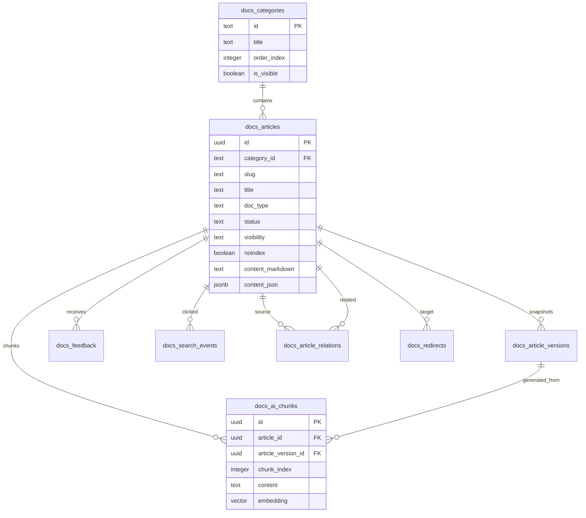

# 문서센터 DB 설계

기준 시점: 2026-04-21
범위: 공개 홈 화면의 `가이드`, `매뉴얼`, `도움말`, `문제 해결`, `업데이트` 문서센터와 AI 챗봇 지식 베이스

관련 콘텐츠 지침: [docs-center-content-guidelines.md](./docs-center-content-guidelines.md)

## 1. 제품 원칙

문서센터는 단순 FAQ 페이지가 아니라, ClassIn 도입 학원이 수업 운영을 스스로 안정화할 수 있게 만드는 공개 지식 베이스다. 외부 사용자에게는 차분한 가이드처럼 보여야 하고, 내부 운영팀에게는 CS 반복 질문, 검색어, 챗봇 답변 품질을 개선하는 데이터 레이어가 되어야 한다.

에러 조치 문서는 메인 메시지로 전면 노출하지 않는다. 대신 `문제 해결`을 문서센터 안의 한 카테고리로 두고, 홈/헤더에서는 `가이드`를 대표 진입점으로 둔다. 필요한 사용자는 검색, FAQ, 관련 문서, SEO를 통해 도달하고, 처음 보는 원장님에게는 "문제가 많은 제품"이 아니라 "운영이 준비된 제품"으로 인식되게 한다.

## 2. 정보 구조

공개 라우트는 현재 정적 데이터로 먼저 구현하고, DB 전환 시에도 URL 구조는 유지한다.

| 영역 | URL | 목적 |
| --- | --- | --- |
| 문서센터 홈 | `/docs` | 빠른 시작, 운영 가이드, 매뉴얼, 도움말, 문제 해결, 업데이트의 상위 허브 |
| 카테고리 목록 | `/docs/[category]` | 카테고리별 문서 목록과 권장 읽기 순서 |
| 문서 상세 | `/docs/[category]/[slug]` | 본문, 목차, 관련 문서, 챗봇 요약 |
| 기존 FAQ | `/faq` | 마케팅 FAQ 허브. 상세 FAQ는 `/docs/help/faq`로 연결 |
| 사이트맵 | `/sitemap.xml` | 공개 문서와 unlisted 문서의 검색 노출 제어 |

## 3. DB 모델

마이그레이션 파일: `supabase/migrations/20260421_docs_center.sql`

연관 문서: `docs/active/chatbot-knowledgebase-faq-analytics-plan.md`

현재 기준에서는 `docs_articles`와 `docs_ai_chunks`가 공개 문서센터의 원본이다. 더 넓은 챗봇 시스템에서 요금, 제품 정보, 상담 정책까지 함께 색인해야 할 때는 `knowledge_sources`, `knowledge_chunks` 같은 통합 지식 레이어를 별도로 두거나, `docs_ai_chunks`를 그 레이어로 동기화한다.



## 4. 테이블 책임

`docs_categories`는 공개 문서센터의 카테고리 정의다. 현재 카테고리는 `quick-start`, `guides`, `manual`, `help`, `troubleshooting`, `updates`로 시작한다.

`docs_articles`는 문서의 단일 원본이다. 사용 가이드, 기능 매뉴얼, FAQ, 문제 해결, 릴리즈 노트를 모두 같은 테이블에서 관리한다. `doc_type`, `product_area`, `difficulty`, `audience`, `tags`, `keywords`, `symptoms`로 검색과 추천을 제어한다.

`docs_article_versions`는 문서 변경 이력을 보관한다. 운영 문서는 상담 스크립트와 제품 동작이 바뀔 때 영향이 크기 때문에, 롤백과 변경 사유 추적이 가능해야 한다.

`docs_article_relations`는 관련 문서 그래프다. 예를 들어 "학생 로그인 안내" 뒤에 "수업 전 체크리스트", "음성 문제 해결"을 이어 붙일 수 있다. 챗봇은 이 관계를 답변 확장 컨텍스트로 사용할 수 있다.

`docs_ai_chunks`는 챗봇/RAG용 청크 테이블이다. 원문은 항상 `docs_articles`에 남기고, 청크는 파생 데이터로만 취급한다. 임베딩 컬럼은 준비해두되, 초기에는 키워드 검색과 수동 답변 품질 확인부터 시작한다.

`docs_feedback`는 문서별 도움이 되었는지 여부를 기록한다. 부정 피드백은 제품 결함처럼 보이게 노출하지 않고, 내부 콘텐츠 개선 큐로만 사용한다.

`docs_search_events`는 검색어와 클릭 결과를 기록한다. 검색했지만 결과가 없거나 클릭이 없는 질문은 다음 FAQ/가이드 후보가 된다.

`docs_redirects`는 문서 URL을 바꿀 때 SEO 손실을 줄이기 위한 리다이렉트 테이블이다.

## 5. 노출 정책

`status`는 작성 워크플로우를 의미한다. `draft`, `review`, `published`, `archived`로 나누고 공개 페이지는 `published`만 읽는다.

`visibility`는 접근 전략을 의미한다. `public`은 목록에 노출하고, `unlisted`는 직접 링크와 관련 문서, SEO 유입은 허용하지만 대표 화면에서는 덜 강조한다. `internal`은 운영팀과 어드민 전용 문서다.

`noindex`는 검색엔진 노출 제어다. 부정적 인식이 강한 장애성 문서나 내부 운영 메모는 접근 가능하더라도 `noindex`로 둔다. 반대로 "수업 전 음성 체크", "학생 접속 안내"처럼 고객이 실제로 검색하는 문제 해결 문서는 긍정적인 실행 가이드 톤으로 공개한다.

## 6. AI 챗봇 데이터 흐름

1. 운영팀이 `docs_articles`의 원문을 작성하거나 수정한다.
2. 게시 시점에 `docs_article_versions`에 스냅샷을 남긴다.
3. 배치 작업이 제목, 섹션, 증상, 대상 독자를 기준으로 `docs_ai_chunks`를 생성한다.
4. 검색과 챗봇은 `status = published`, `visibility in ('public', 'unlisted')`, `noindex = false`를 기본 검색 풀로 사용한다.
5. 상담원이 직접 확인해야 하는 민감 문서는 `internal`로 두고 챗봇 공개 답변에는 사용하지 않는다.
6. `docs_feedback`와 `docs_search_events`를 보고 답변 누락, 어려운 표현, 반복 문의를 문서 개선 backlog로 전환한다.

## 7. 운영 단계

v0는 현재처럼 `lib/docs.ts` 정적 데이터로 빠르게 페이지를 연다. 이 단계에서는 톤, 구조, SEO, 탐색 경험을 먼저 검증한다.

v1은 마이그레이션을 적용하고 정적 문서를 seed 데이터로 넣는다. 공개 페이지는 DB를 읽되, 실패 시 정적 데이터로 fallback할 수 있게 둔다.

초기 seed 스크립트는 `scripts/seed-docs.ts`다.

```bash
npx tsx scripts/seed-docs.ts --dry-run
NEXT_PUBLIC_SUPABASE_URL=... SUPABASE_SERVICE_ROLE_KEY=... npx tsx scripts/seed-docs.ts
```

이 스크립트는 `lib/docs.ts`를 기준으로 카테고리, 문서, 초기 버전, AI 청크, 관련 문서를 생성한다. 문서와 카테고리는 upsert하고, AI 청크는 파생 데이터이므로 seeded 문서 기준으로 교체한다.

공개 페이지는 `lib/docs-content.ts`를 통해 문서를 읽는다. 기본값은 정적 `lib/docs.ts`이고, 운영에서 `USE_SUPABASE_DOCS=true`를 켜면 Supabase 문서 테이블을 읽는다. DB 조회나 환경변수 문제가 생기면 정적 문서로 fallback한다.

v2는 어드민 문서 편집 화면을 붙인다. 작성, 리뷰, 게시, 보관, 관련 문서 연결, `noindex` 설정을 운영팀이 직접 관리한다.

v3는 검색 로그와 피드백 대시보드를 만든다. 결과 없는 검색어, 도움이 안 됨 비율이 높은 문서, 챗봇 fallback 질문을 우선순위로 정렬한다.

v4는 임베딩 파이프라인을 붙인다. 문서 수와 모델이 안정된 뒤 `docs_ai_chunks.embedding`에 HNSW 인덱스를 추가한다.

## 8. 보안과 RLS

공개 사용자는 visible 카테고리, published 문서, 공개 문서의 관계와 청크만 읽을 수 있다. 관련 문서는 원본과 대상 문서가 모두 공개 가능한 상태일 때만 노출한다.

문서 작성과 수정은 `service_role` 기반 서버 라우트나 어드민 백오피스에서만 처리한다. 브라우저에서 직접 문서 CRUD를 허용하지 않는다.

피드백과 검색 이벤트는 브라우저에서 직접 insert하지 않는다. 공개 API 라우트가 rate limit, 봇 필터링, 길이 제한, IP 기반 abuse 방어를 먼저 처리한 뒤 `service_role`로 저장한다. DB는 콘텐츠 운영에 필요한 최소 데이터만 저장하고, 개인정보성 상담 내용은 넣지 않는다.
