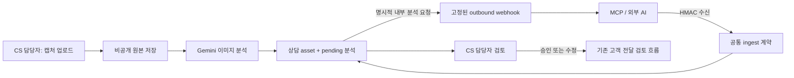

# 내부 CS 멀티모달·AI 브리지

## 목적과 권한 경계

내부 CS 상담에 캡처·사진 원본과 AI 분석을 함께 누적하고, 사내에서 승인한 AI/MCP 어댑터와 같은 상담 단위로 정보를 주고받는다. 이 브리지는 **고객 전달 채널이 아니다.** 외부 AI가 반환한 분석·답변은 `assistant` 메시지의 `pending` 상태로 저장되며, 고객 전달 가능 문안으로 확정하는 권한은 기존 CS 담당자 검토 API에만 있다.

이미지 분석 결과도 기본 `pending`이다. 담당자는 이미지 검토 API에서 승인·수정 요청·거절할 수 있다. 원본과 분석은 공개 챗봇 지식과 분리된 비공개 저장소를 사용한다.

## 구성

- 관리자 이미지 업로드: `POST /api/admin/cs-chat/conversations/{conversationId}/assets`
- 이미지 분석 검토: `PATCH /api/admin/cs-chat/conversations/{conversationId}/assets/{assetId}`
- 서명된 AI/MCP 수신: `POST /api/webhook/internal-cs`
- 관리자 명시적 외부 분석 요청: `POST /api/admin/cs-chat/conversations/{conversationId}/dispatch`
- 연동 준비 상태: `GET /api/admin/cs-chat/integrations/status`
- 데이터 모델: [`../../supabase/migrations/20260716_internal_cs_multimodal_bridge.sql`](../../supabase/migrations/20260716_internal_cs_multimodal_bridge.sql)
- 저장소 계층: [`../../lib/repositories/internal-cs-chat.ts`](../../lib/repositories/internal-cs-chat.ts)
- 이미지 저장소: [`../../lib/storage/internal-cs-assets.ts`](../../lib/storage/internal-cs-assets.ts)



## 이미지 업로드와 분석

관리자 업로드는 `multipart/form-data`를 사용한다.

- `file`: 필수. JPEG, PNG, WebP만 허용한다.
- `instruction`: 선택. 이미지에서 중점 확인할 내용을 2,000자 이내로 전달한다.
- `requestedMode`: `auto`, `fast`, `deep` 중 하나다.

파일 확장자나 브라우저 MIME만 신뢰하지 않고 실제 바이트 시그니처를 검사한다. 최대 크기는 8MB다. 원본은 `internal-cs-assets` 비공개 버킷에 콘텐츠 해시 기반 경로로 저장하고 같은 상담의 동일 해시는 재사용한다. 화면 표시용 URL은 짧은 만료 시간을 둔 서명 URL이다.

기본 이미지 분석 체인은 다음과 같다.

- 일반 분석: `gemini-3.5-flash` → `gemini-3.1-flash-lite`
- `deep` 분석: `gemini-3.1-pro-preview` → `gemini-3.5-flash` → `gemini-3.1-flash-lite`
- 키·네트워크·모델 응답 실패: 사실을 추정하지 않는 deterministic 수동 검토 안내

분석은 요약, 보이는 텍스트, 관찰 사실, 민감정보 경고, 제안 태그, 후속 질문으로 나뉜다. 어떤 결과도 자동 승인되지 않는다.

검토 요청 예시는 다음 필드를 사용한다.

```json
{
  "decision": "changes_requested",
  "reviewNote": "계정 식별자는 분석에서 제외",
  "correctedAnalysis": "화면에 수업 입장 실패 안내가 표시됨"
}
```

`decision`은 `approved`, `changes_requested`, `rejected` 중 하나다.

## HMAC 수신 계약

계약 버전은 `2026-07-16`이다. 발신자는 JSON을 문자열로 직렬화한 **원문 바이트**에 HMAC-SHA256을 계산하고 아래 헤더를 보낸다.

- `x-internal-cs-signature: sha256=<hex digest>`
- `content-type: application/json`

서버는 raw body 기준으로 서명을 비교한다. 수신 secret이 없거나 32자 미만이면 엔드포인트는 `503`으로 닫힌다. 실제 body와 `Content-Length` 모두 제한하며, IP 단위 rate limit을 적용한다.

공통 필드는 다음과 같다.

```json
{
  "version": "2026-07-16",
  "eventType": "cs.analysis.created",
  "sourceSystem": "approved-ai-adapter",
  "transport": "mcp",
  "idempotencyKey": "unique-per-source",
  "correlationId": "optional-workflow-id",
  "conversationId": "existing-conversation-uuid",
  "content": "분석 초안",
  "model": {
    "provider": "provider-name",
    "name": "model-name",
    "mode": "deep"
  }
}
```

지원 event type:

| eventType | 동작 |
|---|---|
| `cs.context.request` | 기존 상담의 메시지와 이미지 분석을 반환한다. |
| `cs.message.created` | 외부에서 들어온 질문을 `user` 메시지로 누적한다. |
| `cs.observation.created` | 작업 메모를 `internal_note`로 누적한다. |
| `cs.analysis.created` | 외부 AI 결과를 `assistant/pending`으로 누적한다. |
| `cs.asset.created` | base64 이미지 원본을 저장하고 선택적으로 분석한다. |

새 상담을 만들 때는 `conversationId` 대신 아래 객체를 보낼 수 있다. `cs.context.request`는 반드시 기존 `conversationId`를 사용한다.

```json
{
  "conversation": {
    "title": "신규 내부 분석",
    "priority": "normal",
    "tags": ["capture"],
    "customerContext": {}
  }
}
```

이미지는 원격 URL을 받지 않는다. 서버의 SSRF 면적을 없애기 위해 검증 가능한 base64 바이트만 허용한다.

```json
{
  "eventType": "cs.asset.created",
  "image": {
    "fileName": "capture.png",
    "mimeType": "image/png",
    "base64": "<base64 bytes only>",
    "analyze": true,
    "instruction": "오류 문구와 화면 상태 확인"
  }
}
```

event 저장 로그에는 원본 base64나 메시지 본문을 복제하지 않는다. event type, source, model, 본문 길이, asset id 같은 redacted metadata와 처리 결과 ID만 남긴다.

`sourceSystem + direction + idempotencyKey`는 DB unique 제약으로 중복 누적을 막는다. 전달 방식은 at-least-once로 보고, 호출자는 동일 작업 재시도 시 같은 idempotency key를 재사용해야 한다. 처리 중 장애가 난 event는 `failed` 상태와 일반화된 오류만 기록한다.

## context request와 원본 공개 범위

기본 context 응답에는 다음만 포함한다.

- 상담: id, 제목, 상태, 우선순위, 태그, 마지막 메시지 시각
- 메시지: 역할, 본문, 검토 상태, 승인자가 교정한 본문, 모델 식별자
- 이미지: 파일명, MIME, 분석 상태·요약·구조화 결과, 검토 상태

담당자·생성자 식별자와 `customer_context`는 v1 브리지에서 제외한다. 원본 이미지 서명 URL도 기본 제외다. 내부 AI가 원본 픽셀을 꼭 받아야 하는 작업만 아래 두 필드를 동시에 `true`로 보낸다.

```json
{
  "includeOriginalAssets": true,
  "acknowledgeSensitiveData": true
}
```

## outbound dispatch

관리자 인증을 통과한 CS 담당자의 명시적 `POST`만 내부 AI 분석 요청을 시작한다. 목적 URL은 요청 body에서 받지 않고 배포 환경의 `INTERNAL_CS_OUTBOUND_WEBHOOK_URL`만 사용한다. URL은 HTTPS·공인 IP 검증과 DNS rebinding 방어를 거치며 redirect를 따라가지 않는다.

outbound body는 `cs.context.available` envelope다. 수신 측은 `2xx`로 접수 여부를 반환하고, 분석 결과는 다시 `cs.analysis.created`로 ingest한다. outbound도 raw JSON HMAC 서명을 사용한다. 원본 이미지는 위의 이중 확인 필드가 있을 때만 포함한다.

## MCP 연결 방식

MCP 서버는 별도 DB 접근 권한을 가지지 않고 같은 HTTP 계약의 얇은 어댑터로 둔다.

- `internal_cs_pull(conversation_id)`: `cs.context.request`를 서명해 ingest endpoint에 전송한다.
- `internal_cs_ingest_analysis(...)`: `cs.analysis.created`를 서명해 전송한다.
- `internal_cs_ingest_capture(...)`: 로컬 캡처 바이트를 base64로 바꾸고 `cs.asset.created`로 전송한다.

각 MCP tool은 새 idempotency key를 만들고 재시도 동안 유지한다. MCP 로그에는 secret, 원본 본문, base64를 남기지 않는다. 외부 도구가 자체 스킬로 캡처하더라도 서버가 MIME·바이트 시그니처를 다시 검증한다.

## 환경 설정과 운영 확인

예시 키는 [`../../.env.local.example`](../../.env.local.example)에 있다.

- `INTERNAL_CS_INGEST_SECRET`: inbound raw-body HMAC secret
- `INTERNAL_CS_OUTBOUND_WEBHOOK_URL`: 서버가 승인한 고정 HTTPS 목적지
- `INTERNAL_CS_OUTBOUND_WEBHOOK_SECRET`: outbound raw-body HMAC secret

운영 순서:

1. DB migration과 비공개 storage bucket 정책을 적용한다.
2. server-only 환경 변수를 설정한다.
3. `/api/admin/cs-chat/integrations/status`에서 inbound/outbound 준비 상태를 확인한다.
4. 고정된 테스트 상담에서 이미지 업로드와 `pending` 검토 상태를 확인한다.
5. 같은 idempotency key를 두 번 보내 중복 메시지·asset이 생기지 않는지 확인한다.
6. 원본 미포함 dispatch와 이중 확인을 거친 원본 포함 dispatch를 각각 검증한다.

DB 계약 변경 후에는 저장소 기준에 따라 `npm run check:alpha-db`를 함께 실행한다.
