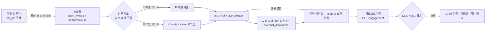
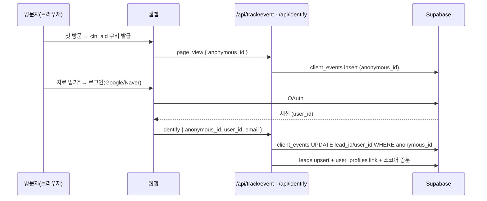
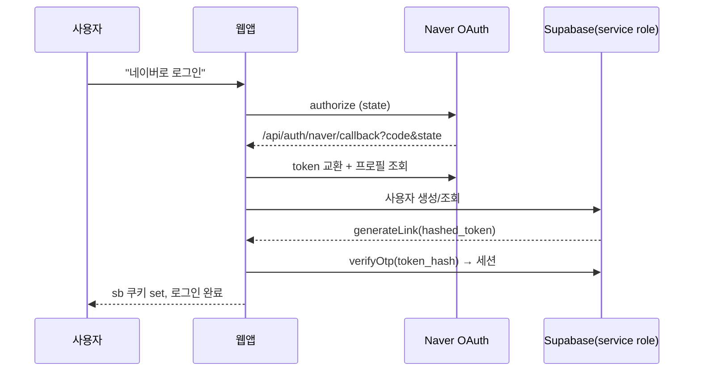
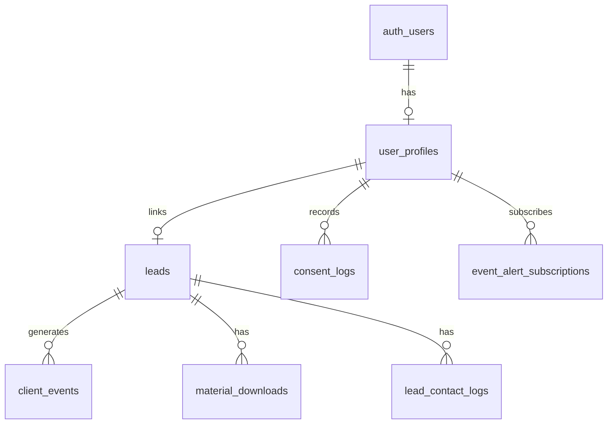

# 마케팅 리드 퍼널 기획 — 동의·트래킹 / 소셜 로그인 / 자료 게이팅 / 리드스코어링

- 작성일: 2026-06-14
- 상태: Draft (구현 착수 전 기획 확정용)
- 범위: 픽셀·쿠키·트래킹, 공개 소셜 로그인(Google/Naver), 자료(자료 받아가기) 게이팅, 리드스코어링
- 확정 결정: **하이브리드 게이팅 / Supabase Auth 확장 + Naver 커스텀 OAuth / 옵트인 동의 + Google Consent Mode v2**
- 검증 게이트: `npx eslint app components lib --max-warnings=0` · `npm run build`

---

## 1. 배경과 목표

지금까지는 "익명 트래킹(픽셀)"과 "리드 캡처(폼)"가 **서로 끊겨** 있었다. 픽셀/내부 이벤트(`client_events`)는 익명이고, 리드(`leads`)는 폼 제출 시점의 스냅샷만 가진다. 그래서:

- 어떤 방문자가 가격표를 3번 보고 데모 영상을 본 뒤 자료를 받았는지 **행동 기반으로 알 수 없다.**
- 리드스코어링이 출처 + 연락처 완성도(`calcScore()`)만으로 계산돼 **실제 구매 의도를 반영하지 못한다.**
- 자료는 정적/이메일 게이팅이라 **누가 무엇을 받아갔는지 신원과 연결되지 않는다.**

**핵심 목표:** 로그인을 "익명 트래킹 → 알려진 리드"를 잇는 **신원 결합(identity stitching)의 키스톤**으로 삼아, 네 요소를 하나의 퍼널로 통합한다.

> 익명 방문(쿠키/픽셀) → 동의 → 행동 트래킹 → 자료 받기(소셜 로그인) → 리드 식별 → 익명 행동을 리드에 결합 → 행동 기반 리드스코어링 → MQL/SQL 자동 분류 → CRM/영업 알림

---

## 2. 한 장 요약 (TL;DR)

| 요소 | 현재 | 이번 기획으로 추가 |
| --- | --- | --- |
| 트래킹 | GTM·Meta·Kakao 픽셀 + `client_events`(익명) | **Naver(wcs)** 추가, `anonymous_id`/`lead_id` 결합, **서버사이드 전환 API(Meta·Google·Kakao·Naver·TikTok) 가능한 전부** |
| 쿠키/동의 | 배너 없음, 픽셀 즉시 발화 | **옵트인 배너 + Consent Mode v2**, 동의 후 발화, `consent_logs` 감사로그 |
| 로그인 | admin/partner만 Supabase Auth | **공개 사용자 로그인**: Google(네이티브) + Naver(커스텀 OAuth), `user_profiles` |
| 자료 받기 | 정적/이메일, Notion 링크 | **3단 게이트**(공개/이메일/로그인): 심화 자료·행사 알림만 로그인, 그 외 이메일 + 비공개 Storage·서명 URL |
| 리드스코어링 | `calcScore()` (출처+연락처) | **Fit + Engagement 2축 엔진**, MQL/SQL 라이프사이클, 감쇠, 규칙 설정, 피드백 |

---

## 3. 현황 진단 (As-Is)

### 3.1 트래킹 / 픽셀 — 이미 탄탄, 동의·신원만 공백
- `lib/analytics.ts` — `trackEvent()` 멀티플랫폼 디스패치(dataLayer/gtag/fbq/kakaoPixel + 내부 API)
- `lib/analytics-config.ts` — 플레이스홀더 ID 필터링
- `components/GTMScript.tsx`(GTM), `components/MetaPixelScript.tsx`(Meta), `components/AnalyticsProviders.tsx`(Kakao), `components/PageViewTracker.tsx`(page_view), 통합점 `components/AppChrome.tsx`
- `app/api/track/event/route.ts` — 내부 이벤트 저장(`client_events`), PII 마스킹, 120/min rate-limit, **익명(lead_id 없음)**
- 허용 이벤트: `page_view, click_cta, submit_demo_request, submit_newsletter, download_materials, view_demo_video, begin_checkout, purchase`
- CSP: `next.config.ts`에 GTM/GA/Meta/Daum(Kakao)/Channel/Toss 화이트리스트
- **공백:** Naver(wcs) 미구현, GA4 직접 연동 없음(GTM 경유만), **동의 배너 전무**, 이벤트↔리드 결합 없음

### 3.2 쿠키/동의 — 전무 (법적 공백)
- 동의 배너/모달/카테고리/저장소 **하나도 없음**. 픽셀이 동의 없이 즉시 발화.
- `app/privacy/page.tsx`에 쿠키·서드파티 도구·동의철회권 **문구는 있으나** UI·기록 없음.
- 글로벌 EEO(=GDPR 노출) + 한국 PIPA 모두 옵트인 압박.

### 3.3 리드 캡처 / CRM — 풍부함
- `leads` 모델에 UTM·gclid·fbclid·msclkid·ttclid·landing_page·referrer·lead_magnet·source_detail **어트리뷰션 이미 존재** (`lib/repositories/leads.ts`)
- 캡처: `POST /api/lead`, `POST /api/newsletter/subscribe`, Meta webhook → `lib/server/lead-capture.ts`(rate-limit·허니팟·중복·자동화·구독 동기화)
- CRM: `app/admin/crm/`(leads/customers/deals/quotes/contracts/revenue/matching), 상호작용 `lead_contact_logs`
- 일일 크론 `app/api/cron/lead-response-alerts/route.ts` — Meta·홈페이지 리드 아침 공지.
  `lib/server/lead-response-alerts.ts`와 미응답누적·24/48시간 Webhook 발송은 2026-09-02 폐기됐다.

### 3.4 리드스코어링 — 초보 수준
- `components/admin/crm/leads/shared.tsx`의 `calcScore()`: 출처(데모40/문의25/Meta25/뉴스10) + 연락처(전화20/이메일5) + 규모 + org, 최대 100.
- **공백:** 행동/참여 점수, 이벤트↔리드 연결, MQL/SQL 단계, 감쇠, 설정형 규칙, 전환 피드백 전부 없음.

### 3.5 로그인 — 공개 사용자 없음
- Supabase Auth는 **admin/partner 전용**(`lib/admin-auth.ts`, `admin_profiles`, `partner_account_users`).
- 클라이언트: `lib/supabase/browser.ts`(`NEXT_PUBLIC_SUPABASE_URL`, `NEXT_PUBLIC_SUPABASE_PUBLISHABLE_KEY`), 서버: `lib/supabase/server.ts`, 서비스롤: `lib/supabase/admin.ts`(`SUPABASE_SECRET_KEY`), 세션 갱신: `lib/supabase/middleware.ts`
- **공백:** 공개 `user_profiles` 없음, Google/Naver OAuth·콜백 라우트 없음.

### 3.6 자료 / 게이팅 — 미완, 단 좋은 선례 있음
- 리드매그넷 정적 정의 `lib/lead-magnets.ts`, 페이지 `app/resources/[slug]/page.tsx`(현재 공개·정적), 브로셔는 Notion 링크(`lib/marketing-links.ts`), 일부 PDF는 `public/docs/files/`.
- **토큰 게이팅 선례**: `app/share/{quote,contract}/[token]` — 암호학적 토큰·만료·공개열람·뷰로그. 자료 게이팅 설계의 모범 사례.
- **공백:** 비공개 Storage 버킷, 서명 URL 다운로드 엔드포인트, 다운로드↔신원 기록 없음.

---

## 4. 확정된 핵심 결정

| # | 결정 | 선택 | 파생 설계 |
| --- | --- | --- | --- |
| D1 | 자료 게이팅 강도 | **하이브리드(3단)** | **로그인 필수는 ①심화 자료 다운 ②행사 알림 받기 두 가지만.** 회사소개서·가격표·도입가이드·체크리스트 등은 이메일 게이트. 자료별 `gate: 'open' \| 'email' \| 'login'` 메타. |
| D2 | 로그인 구현 | **Supabase 확장 + Naver 커스텀** | Google=Supabase 네이티브 OAuth. Naver=서버사이드 OAuth 콜백 → 서비스롤로 사용자 생성/조회 → magic-link `verifyOtp`로 Supabase 세션 발급. 인증 스택 단일화. |
| D3 | 동의 모델 | **옵트인 + Consent Mode v2** | 동의 전 마케팅/분석 픽셀 차단(default denied), 카테고리(필수/분석/마케팅) 토글, 동의 후 update. `consent_logs` 감사로그. |
| D4 | 메일 발송 채널 | **기존 자동화 메일러 재사용** | 서명 링크·다운로드 안내·행사 알림을 기존 자동화(`lib/repositories/automation.ts`) 경로로 발송. 별도 메일러 미도입. |
| D5 | 전환 추적 범위 | **서버사이드 전환 API 가능한 전부** | Meta CAPI·Google(MP/Enhanced)·Kakao·Naver·TikTok 중 지원되는 전부. 브라우저 픽셀과 `event_id` 중복제거, 마케팅 동의 게이트 준수. |

**파생 아키텍처 결정**
- A1. 신원 결합 키: 최초 방문 시 1st-party 쿠키 `cln_aid`(UUID) 발급, 모든 `client_events`에 부착. 로그인/리드 생성 시 익명 이벤트를 `lead_id`/`user_id`로 소급 결합.
- A2. 스코어링은 **이벤트 인입 시 증분 + 일일 크론 전량 재계산/감쇠**(Vercel Hobby = 크론 일 1회 제약 준수).
- A3. 스코어링 규칙은 **1차 코드 설정(`lib/lead-scoring/rules.ts`)**, 2차에 DB 테이블 + 관리자 UI로 승격.
- A4. 자료 다운로드는 **비공개 Storage + 단기 서명 URL**, 이메일 게이트는 `/share` 토큰 선례 재사용.

---

## 5. 목표 데이터 흐름 (To-Be)



신원 결합(identity stitching) 시퀀스:



---

## 6. 워크스트림 상세

### WS1 — 동의(Consent) + 픽셀/쿠키/트래킹

**목표:** 옵트인 배너 + Consent Mode v2, 동의 후 픽셀 발화, Naver 추가, 이벤트에 신원 키 부착.

1. **동의 배너/센터** (`components/consent/ConsentBanner.tsx`, `ConsentCenter.tsx`)
   - 카테고리: `necessary`(항상 on), `analytics`, `marketing`.
   - 저장: 1st-party 쿠키 `cln_consent`(JSON, 정책버전 포함) + 서버 `consent_logs` 기록.
   - 푸터에 "쿠키 설정" 재오픈 링크(동의철회권 충족).
2. **Consent Mode v2 디폴트 차단**
   - GTM 로드 **이전**에 `gtag('consent','default',{ ad_storage:'denied', analytics_storage:'denied', ad_user_data:'denied', ad_personalization:'denied' })` 주입 → 동의 시 `update`.
   - `components/GTMScript.tsx`에 consent default 부트스트랩 추가.
3. **픽셀 발화 게이팅**
   - `components/MetaPixelScript.tsx`, `components/AnalyticsProviders.tsx`(Kakao), 신규 Naver를 **marketing 동의 후에만** 마운트.
   - `components/AppChrome.tsx`에서 동의 상태 구독 후 조건부 렌더.
4. **Naver 추가**
   - Naver Analytics(wcs): `//wcs.naver.net/wcslog.js` + `wcs_add["wa"]=NAVER_WCS_ID; wcs_do()` → `components/NaverAnalyticsScript.tsx`(analytics 동의 게이트).
   - Naver 전환 스크립트(광고 집행 시): marketing 동의 게이트.
   - `lib/analytics.ts`에 Naver 디스패치 분기 추가, `lib/analytics-config.ts`에 `NEXT_PUBLIC_NAVER_WCS_ID` 검증.
5. **이벤트 신원 키 부착**
   - `lib/analytics.ts`/`app/api/track/event/route.ts`에서 모든 이벤트에 `anonymous_id`(cln_aid), 로그인 시 `user_id` 부착.
6. **CSP 갱신** (`next.config.ts`)
   - 추가: `wcs.naver.net`, `wcs.naver.com`, `nid.naver.com`, `openapi.naver.com`(로그인), Naver 광고 도메인.
7. **서버사이드 전환 API (D5 — 가능한 전부)** `lib/conversions/*`
   - **Meta Conversions API(CAPI)**: 해시된 이메일/전화 + `event_id`로 브라우저 `fbq`와 중복제거.
   - **Google**: GA4 Measurement Protocol + Google Ads Enhanced Conversions(gclid 활용).
   - **Kakao / Naver / TikTok**: 각 플랫폼 서버 전환 API 지원 범위 내에서 연동(미지원 시 클라이언트 전환 스크립트로 폴백; Naver는 클라이언트 중심일 수 있음).
   - **발화 지점**(고가치 이벤트, 서버에서 1회): `lib/server/lead-capture.ts`(Lead), 인증 콜백(CompleteRegistration), 다운로드 엔드포인트(심화 자료), 결제(Purchase).
   - **동의/PII**: 마케팅 동의가 있는 사용자만 서버 전환 발화, PII는 해시 전송. gclid/fbclid/ttclid는 `leads`에 이미 보관.

> 주의: 동의 디폴트 차단으로 일부 픽셀 데이터 손실은 의도된 트레이드오프(D3). Consent Mode v2의 모델링(behavioral modeling) + 서버사이드 전환 API(D5)가 손실을 보정.

### WS2 — 공개 소셜 로그인 (Google 네이티브 + Naver 커스텀)

**목표:** 공개 사용자가 Google/Naver로 로그인, Supabase 세션 단일화, `user_profiles` 생성.

1. **공개 인증 분리**
   - admin/partner 가드(`lib/admin-auth.ts`, `lib/portal/portal-authorize.ts`)와 **권한 분리** — 공개 사용자는 admin 권한 절대 없음.
   - 공개용 헬퍼 `lib/auth/public-user.ts`(현재 세션 → user_profiles 매핑, 권한=public).
2. **Google (네이티브)**
   - `supabase.auth.signInWithOAuth({ provider:'google', options:{ redirectTo:'/auth/callback' }})`
   - 콜백 `app/auth/callback/route.ts` → `exchangeCodeForSession` → `user_profiles` upsert.
3. **Naver (커스텀 OAuth)** — Supabase 네이티브 미지원이므로:
   - `app/api/auth/naver/start/route.ts`: state 발급 후 `https://nid.naver.com/oauth2.0/authorize`로 리다이렉트.
   - `app/api/auth/naver/callback/route.ts`:
     1. code→token 교환(`https://nid.naver.com/oauth2.0/token`, `NAVER_CLIENT_SECRET`)
     2. 프로필 조회(`https://openapi.naver.com/v1/nid/me`) → naver id·email·name
     3. 서비스롤(`lib/supabase/admin.ts`)로 사용자 생성/조회
     4. `admin.generateLink({ type:'magiclink', email })`로 `hashed_token`만 획득 → **쿠키 쓰기 SSR 클라이언트**(`NextResponse.redirect`에 부착, 패턴 `lib/supabase/middleware.ts`)로 `verifyOtp({ type:'email', token_hash })` → 세션 쿠키 set. ⚠️ 서비스롤로는 쿠키 못 씀, 타입은 `'email'`(‘magiclink’ 아님) — 리뷰 N1·N2
   - 엣지케이스: Naver가 email scope 미동의 시 email 없을 수 있음 → 로그인 단계에서 email 제공 동의 요청, 부재 시 추가 입력 폼으로 폴백.
4. **데이터:** `user_profiles`(아래 §7), email로 기존 `leads`/`subscribers`와 연결.
5. **UX:** 로그인 모달 `components/auth/LoginModal.tsx`(Google/Naver 버튼), 자료 받기 흐름에서 호출 후 **원래 동작 자동 재개**.



### WS3 — 자료 게이팅 다운로드 + 행사 알림 (하이브리드 3단)

**목표:** 게이트 3단 차등, 비공개 Storage + 서명 URL, 다운로드↔신원 기록, 행사 알림 구독.

게이트 정책(D1 확정):

| 게이트 | 대상 | 식별 |
| --- | --- | --- |
| `open` | 미리보기·요약 등 | 없음 |
| `email` | 회사소개서·가격표·도입가이드·체크리스트 등 일반 자료 | 이메일(또는 로그인) |
| `login` | **심화 자료 다운**, **행사 알림 받기** | Google/Naver 로그인 필수 |

1. **자료 레지스트리 확장** (`lib/lead-magnets.ts` 또는 신규 `lib/materials.ts`)
   - 필드 추가: `gate: 'open' | 'email' | 'login'`, `tier`('basic' | 'advanced'), `storagePath`, `category`, `published`.
   - 심화(`tier: 'advanced'`) 자료만 `gate: 'login'`, 그 외 일반 자료는 `gate: 'email'`.
2. **스토리지:** 비공개 버킷 `materials` 생성, PDF 업로드. 공개 버킷(event/blog-images)과 분리.
3. **다운로드 엔드포인트** `app/api/materials/[slug]/download/route.ts`
   - 게이트 검사: `login`이면 유효 Supabase 공개 세션 필수, `email`이면 검증된 리드/구독 토큰 또는 로그인.
   - 통과 시 `createSignedUrl(path, 60s)` 발급 → 리다이렉트(또는 스트리밍).
   - 기록: `material_downloads` insert + `download_materials` 이벤트(**lead_id/user_id 포함**) + 참여점수 증분 + 심화 자료는 서버 전환(D5) 발화.
4. **행사 알림 받기(로그인 필수)** `app/api/events/alerts/subscribe/route.ts`
   - 기존 `components/events/EventAlertSignup.tsx`(현재 `submitLead` 이메일 전용)를 **로그인 게이트로 전환** — 미인증 시 로그인 모달.
   - 로그인 사용자만 구독, `event_alert_subscriptions`에 기록(채널·관심 카테고리).
   - 1차 신규 행사 발행 알림, 2차 구독 행사 D-1 리마인더 — **기존 자동화 메일러(D4)**로 발송(별도 메일러 미도입).
   - 기존 이벤트 시스템(`app/events/[slug]`, `lib/types/event-metrics.ts`)과 연계.
5. **이메일 게이트 토큰 + 발송:** `/share` 선례(`app/api/portal/quotes/[id]/share/route.ts`, `lib/repositories/contracts.ts`) 재사용 — 1회성·만료 서명 링크를 **기존 자동화 메일러(D4)**로 발송.
6. **UX:** `app/resources/[slug]/page.tsx` → "자료 받기" / "행사 알림 받기" →
   - 로그인 게이트 & 미인증 → 로그인 모달 → 인증 후 동작 자동 재개.
   - 이메일 게이트 → 이메일 폼 또는 로그인 택1 → 서명 링크/즉시 다운로드.

### WS4 — 리드스코어링 엔진

**목표:** 2축(Fit + Engagement) 점수, MQL/SQL 라이프사이클, 감쇠, 설정형 규칙, 전환 피드백.

1. **점수 구조**
   - **Fit(적합도, 정적):** org/size/role/source → 기존 `calcScore()` 로직 이관·확장.
   - **Engagement(참여도, 행동):** `client_events`에서 가격표 조회, 데모영상 시청, 자료 다운로드, 재방문, 이메일 오픈/클릭 등 가중 합산.
   - **감쇠:** 참여점수에 최근성 decay(예: 30일 반감기).
   - **합산 등급:** A/B/C/D + 라이프사이클(`subscriber → MQL → SQL → SAL → opportunity → customer`).
2. **규칙 설정** `lib/lead-scoring/rules.ts`(1차 코드, 2차 DB+UI). 예시 §15.3.
3. **계산 트리거**
   - 증분: `app/api/track/event/route.ts`·`lib/server/lead-capture.ts`·다운로드 시 해당 리드 점수 갱신.
   - 배치: 신규 일일 크론 `app/api/cron/lead-scoring/route.ts` — 전량 재계산 + 감쇠(Hobby 일 1회).
4. **임계 → 액션:** MQL/SQL 도달 시 기존 자동화(`lib/repositories/automation.ts`)·CRM 작업 큐에 연계,
   영업 배정. 폐기된 미응답 Webhook 모듈에는 연결하지 않는다.
5. **피드백 루프:** 마감(`converted`/`closed`) 리드의 점수 분포 추적 → 임계·가중치 보정 근거(대시보드).
6. **CRM 표면화:** `components/admin/crm/leads/shared.tsx`의 `calcScore()`를 엔진 호출로 교체, 리드보드에 등급·라이프사이클·점수 추이 표시.

---

## 7. 데이터 모델 변경



### 7.1 신규 테이블 (마이그레이션 스케치 — `supabase/migrations/`)

```sql
-- 공개 사용자 프로필
create table user_profiles (
  id uuid primary key references auth.users(id) on delete cascade,
  email text, name text, org text, role text, phone text,
  provider text,                       -- google | naver
  marketing_consent boolean default false,
  lead_id uuid references leads(id),
  created_at timestamptz default now(),
  updated_at timestamptz default now()
);

-- 동의 감사 로그 (PIPA/GDPR)
create table consent_logs (
  id uuid primary key default gen_random_uuid(),
  anonymous_id text, user_id uuid,
  categories jsonb not null,           -- {necessary, analytics, marketing}
  policy_version text not null,
  user_agent text, ip_hash text,       -- IP는 해시만 저장
  created_at timestamptz default now()
);

-- 자료 다운로드 기록
create table material_downloads (
  id uuid primary key default gen_random_uuid(),
  material_slug text not null,
  user_id uuid, lead_id uuid, anonymous_id text,
  gate_type text not null,             -- email | login
  created_at timestamptz default now()
);

-- 행사 알림 구독 (로그인 필수)
create table event_alert_subscriptions (
  id uuid primary key default gen_random_uuid(),
  user_id uuid not null references auth.users(id) on delete cascade,
  lead_id uuid,
  categories jsonb,                    -- 관심 행사 카테고리
  channel text default 'email',        -- email | (확장: sms/kakao)
  status text default 'active',        -- active | unsubscribed
  created_at timestamptz default now()
);
```

> **RLS(리뷰 S3):** 신규 테이블 4종 모두 `enable row level security` + **정책 미부여(기본 거부)**, 서비스롤만 접근 — 익명→신원 맵 유출 방지(패턴 `20260423_rls_admin_only_tables.sql`). `user_profiles`만 필요 시 `using (auth.uid() = id)` 자기행 읽기 추가. *(P0 `consent_logs`는 반영 완료)*

### 7.2 기존 테이블 컬럼 추가

```sql
-- client_events: 신원 결합 키
alter table client_events
  add column anonymous_id text,
  add column lead_id uuid,
  add column user_id uuid,
  add column session_id text;
create index on client_events (anonymous_id);
create index on client_events (lead_id);

-- leads: 스코어링/라이프사이클
alter table leads
  add column user_id uuid,
  add column lead_score int default 0,
  add column lead_score_fit int default 0,
  add column lead_score_engagement int default 0,
  add column lead_grade text,                 -- A | B | C | D
  add column lifecycle_stage text default 'subscriber',
  add column last_activity_at timestamptz,
  add column score_updated_at timestamptz;
```

> 마이그레이션은 기존 듀얼모드(JSON 폴백) 저장소 패턴과 충돌하지 않도록 `lib/repositories/*`의 매핑도 동시 갱신. 실제 파일 경로는 구현 단계에서 재확인.

---

## 8. API / 라우트 설계

| 라우트 | 메서드 | 역할 | 가드 |
| --- | --- | --- | --- |
| `app/auth/callback/route.ts` | GET | Google OAuth 콜백(exchangeCodeForSession) | 공개 |
| `app/api/auth/naver/start/route.ts` | GET | Naver authorize 리다이렉트(state) | 공개 |
| `app/api/auth/naver/callback/route.ts` | GET | Naver 토큰·프로필 → 세션 발급 | 공개 |
| `app/api/identify/route.ts` | POST | anonymous_id ↔ user_id/lead 결합 | 세션 |
| `app/api/materials/[slug]/download/route.ts` | GET | 게이트 검사 → 서명 URL | 게이트별 |
| `app/api/consent/route.ts` | POST | 동의 상태 기록(consent_logs) | 공개 |
| `app/api/cron/lead-scoring/route.ts` | GET | 일일 점수 재계산+감쇠 | 크론 시크릿 |
| `app/api/track/event/route.ts` | POST | (수정) 신원 키 부착 + 점수 증분 | 공개 |
| `app/api/events/alerts/subscribe/route.ts` | POST | 행사 알림 구독(로그인 필수) | 세션 |
| `app/api/conversions/route.ts` | POST | 서버사이드 전환 API 디스패치(Meta/Google/…) | 내부 호출 |

신규 헬퍼: `lib/auth/public-user.ts`, `lib/consent/consent.ts`, `lib/materials.ts`, `lib/lead-scoring/{engine,rules}.ts`, `lib/identity/stitch.ts`, `lib/conversions/{meta,google,kakao,naver,tiktok}.ts`, `lib/events/alerts.ts`, `components/consent/*`, `components/auth/LoginModal.tsx`, `components/NaverAnalyticsScript.tsx`.

---

## 9. 신원 결합 (Identity Stitching) 상세

1. **익명 키 발급:** 미들웨어 **`proxy.ts`**(Next16에서 `middleware.ts` 개명) 응답에 `cln_aid`(UUID, 1st-party, SameSite=Lax, 13개월) 발급. ⚠️ `client_events`는 **서비스롤 insert 전용**(RLS)이고 `sanitizeParams` allowlist가 `lead_id`를 strip하므로, 신원 필드는 라우트에서 쿠키/세션으로 **서버사이드 읽어 타입 컬럼**으로 기록 — 리뷰 S1.
2. **이벤트 태깅:** 모든 `client_events`에 `anonymous_id` 부착(현재 익명 → 식별 가능 키 보유).
3. **결합 시점:** 로그인 성공 / 리드 생성 / 자료 다운로드 시 `POST /api/identify`:
   - `update client_events set lead_id, user_id where anonymous_id = :cln_aid and lead_id is null`
   - `leads`·`user_profiles` 연결, `last_activity_at` 갱신, 점수 증분.
4. **재방문 연속성:** 동일 브라우저 재방문은 `cln_aid` 유지로 연속, 다른 기기는 로그인 시점에 user_id로 병합.
5. **개인정보(옵트인 정합):** `cln_aid`는 **분석 동의 시에만 발급**한다(동의 전 트래킹 쿠키 미설치). 로그인 시점(P1)에는 신원 결합을 위해 존재를 보장. 마케팅/분석 픽셀과 분리.

---

## 10. 개인정보 · 법무 (PIPA / GDPR)

- **이중 구조 유지**(memo: 한국 운영자 KR법 + 글로벌 EEO SG/GDPR) — `app/privacy/page.tsx`, `app/terms/`, `app/data-deletion/page.tsx` 보강(번역 교체 아님, 항목 추가·링크).
- 쿠키 정책 표: 카테고리별 쿠키·목적·보관기간·서드파티 명시(`cln_aid`, `cln_consent`, GTM/GA, Meta, Kakao, Naver, sb-* 세션).
- 동의 감사: `consent_logs`로 "언제/무엇에 동의" 입증, IP는 해시만.
- 데이터 삭제: `user_profiles`·`material_downloads`·`client_events`(user_id) 삭제 경로를 `app/data-deletion` 흐름에 포함.
- 소셜 로그인 고지: 수집 항목(이메일·이름·제공자ID), 목적, 제3자(구글/네이버) 명시.

---

## 11. 관리자 대시보드 / 분석

- 리드보드(`app/admin/crm/customers/leads/`): 등급(A~D)·라이프사이클·Fit/Engagement 분해·점수 추이.
- 퍼널 대시보드: 익명→식별→MQL→SQL→마감 전환율, 자료별 다운로드·전환 기여.
- 스코어 캘리브레이션: 마감 리드 점수 분포 vs 미응답 분포(피드백 루프 근거).
- 동의율 모니터: analytics/marketing 옵트인율(데이터 손실 가늠).

---

## 12. 단계별 로드맵

> Vercel 크론(리뷰 W3로 정정): `vercel.json`에 이미 크론 **12개(일 다회: sync-branch 3×, sync-external-crm 4×)** → Hobby(일1회·2개)로는 불가능 ⇒ **Pro 플랜 추정**(또는 크론 미실행). billing tier 직접 확인 필요. 스코어링은 **event-sourced**(이벤트=source of truth) + **set-based SQL/RPC** 재계산이며, 실행 빈도는 tier에 맞춰 일/시간 단위로 조정한다(증분 계산은 실시간성 보강용).

| Phase | 산출물 | 핵심 작업 |
| --- | --- | --- |
| **P0 — 동의 기반** | 옵트인 배너 + Consent Mode v2 + `cln_aid` | WS1, `consent_logs`, 정책 페이지 보강. **법적 공백 즉시 해소.** |
| **P1 — 신원 결합** | 공개 로그인(Google→Naver) + `user_profiles` + identify | WS2, `client_events` 신원 키, `/api/identify`. 서버 전환(D5) Lead/CompleteRegistration 착수. |
| **P2 — 자료 게이팅·행사 알림** | 3단 게이트 다운로드 + 행사 알림 구독 + 비공개 Storage | WS3, `materials` 버킷, 다운로드 엔드포인트, `event_alert_subscriptions`. |
| **P3 — 리드스코어링** | 2축 엔진 + 라이프사이클 + 일일 크론 + 대시보드 | WS4, 규칙 설정, 피드백 루프. |

각 Phase는 독립 배포 가능. P0가 다른 모든 트래킹의 법적 전제이므로 **최우선**. P1은 P3의 데이터 전제. 서버사이드 전환 API(D5)는 P1(Lead·가입)→P2(다운로드)→P3(전환 피드백)에 걸쳐 점진 확대.

---

## 13. 검증 기준 / 품질 게이트

```bash
npx eslint app components lib --max-warnings=0
npm run build
```

- 빌드는 라이브 Supabase 의존(메모: /blog prerender). 오프라인에선 lint + `tsc`로 1차 게이트.
- UI는 DESIGN.md 팔레트·보더(`1px solid rgba(0,0,0,0.08)`)·모바일 우선 준수(동의 배너/로그인 모달 포함).
- 픽셀 발화는 동의 상태별로 수동 검증(브라우저 네트워크 탭에서 동의 전/후 비교).

---

## 14. 리스크 & 미해결 질문

- **R1. Naver email scope 미동의:** verifyOtp 경로가 email 의존 → 부재 시 추가 입력 폴백 필요(설계 반영). 대안: 커스텀 JWT 발급(고급).
- **R2. 동의 디폴트 차단의 데이터 손실:** 의도된 트레이드오프. Consent Mode 모델링 + 서버 전환 API(D5)로 보정, 동의율 모니터로 추적.
- **R3. 듀얼모드(JSON/Supabase) 저장소:** 신규 테이블은 Supabase 전제 → JSON 폴백 경로 영향 검토 필요.
- **R4. CSP 'unsafe-inline':** 픽셀 인라인 부트스트랩 유지 vs nonce(ISR 캐싱 손실) — 현행 유지 가정.
- **R5. 전환 API 플랫폼 편차(D5):** Meta CAPI·Google MP는 성숙, Kakao·Naver·TikTok 서버 전환은 계정/지원 범위에 따라 가용성 상이 → 가능한 것부터, 미지원은 클라이언트 전환으로 폴백.
- **결정됨(Q1):** 로그인 필수 = **심화 자료 다운 + 행사 알림 받기** 두 가지만. 일반 자료(회사소개서·가격표·도입가이드·체크리스트)는 이메일 게이트.
- **결정됨(Q2):** 메일 발송은 **기존 자동화 메일러 재사용**(D4).
- **결정됨(Q3):** 서버사이드 전환 API **가능한 전부**(D5).
- **결정됨(Q4):** 자료 3티어 확정 — `open`(설치·가입 지원 PDF) / `email`(회사소개서·체크리스트·도입 요약) / `login`(심화: ROI 리포트·도입 플레이북·업종별 사례집·보안 백서 — **대부분 신규 제작 콘텐츠**). 상세 §15.6.
- **결정됨(Q5):** 행사 알림 = 로그인 필수. 1차 **신규 행사 발행 알림**(이메일/자동화 메일러 D4), 2차 **구독 행사 D-1 리마인더**. 카카오 알림톡/SMS는 확장. 기존 `components/events/EventAlertSignup.tsx`(현재 이메일 전용)를 로그인 게이트로 전환.

---

## 15. 부록

### 15.1 신규 환경 변수 (`.env.local.example` 추가)
```
# Naver 로그인
NAVER_CLIENT_ID=
NAVER_CLIENT_SECRET=
NEXT_PUBLIC_NAVER_CLIENT_ID=
NAVER_CALLBACK_URL=
# Naver Analytics(wcs)
NEXT_PUBLIC_NAVER_WCS_ID=
# 동의 정책 버전
NEXT_PUBLIC_CONSENT_POLICY_VERSION=2026-06-14
# 리드스코어링 크론
CRON_SECRET=
# 서버사이드 전환 API (D5)
# Meta CAPI는 기존 env 재사용: META_CAPI_ACCESS_TOKEN, META_DATASET_ID, META_TEST_EVENT_CODE (이미 존재)
GA4_API_SECRET=
GA4_MEASUREMENT_ID=
GOOGLE_ADS_CONVERSION_ID=
KAKAO_CONVERSION_API_KEY=
TIKTOK_EVENTS_API_TOKEN=
NAVER_AD_API_KEY=
```
> Google OAuth는 Supabase 대시보드에서 provider 설정(앱 env 불필요). `SUPABASE_SECRET_KEY`(서비스롤)는 Naver 세션 발급에 재사용.

### 15.2 표준 행동 이벤트 (스코어링 입력)
| 이벤트 | 신호 | 비고 |
| --- | --- | --- |
| `page_view`(/pricing) | 가격 관심 | 가중↑ |
| `view_demo_video` | 제품 관심 | 가중↑ |
| `download_materials` | 강한 의도 | lead_id 포함(신규) |
| `submit_demo_request` | 최고 의도 | 즉시 MQL 후보 |
| `click_cta` | 약신호 | 저가중 |
| 재방문(세션 분리) | 지속 관심 | 빈도 가중 |

### 15.3 점수 규칙 초안 (`lib/lead-scoring/rules.ts`)
```ts
// Fit (정적, 최대 50)
source: { demo_modal: 25, contact_page: 18, meta_lead_ads: 15, newsletter: 6 }
size:   { '300+': 20, '100-299': 12, '<100': 6 }
hasPhone: +8, hasOrg: +5
// Engagement (행동, 최대 50, 30일 반감기 감쇠)
pricing_view: +6, demo_video: +8, material_download: +12,
demo_request: +20, repeat_visit: +4, email_open: +2, email_click: +5
// 등급: A>=70, B 50-69, C 30-49, D <30
// 라이프사이클: download/demo_request → MQL, 영업 확인 → SQL
```

### 15.4 영향 받는 기존 파일 (요약)
- 수정: `lib/analytics.ts`, `lib/analytics-config.ts`, `components/AppChrome.tsx`, `components/GTMScript.tsx`, `components/MetaPixelScript.tsx`, `components/AnalyticsProviders.tsx`, `app/api/track/event/route.ts`, `next.config.ts`, `lib/server/lead-capture.ts`, `components/admin/crm/leads/shared.tsx`, `lib/lead-magnets.ts`, `app/resources/[slug]/page.tsx`, `app/events/[slug]/*`, `app/privacy/page.tsx`, `.env.local.example`
- 신규: `components/consent/*`, `components/auth/LoginModal.tsx`, `components/NaverAnalyticsScript.tsx`, `lib/auth/public-user.ts`, `lib/consent/consent.ts`, `lib/materials.ts`, `lib/identity/stitch.ts`, `lib/lead-scoring/{engine,rules}.ts`, `lib/conversions/{meta,google,kakao,naver,tiktok}.ts`, `lib/events/alerts.ts`, `app/auth/callback/route.ts`, `app/api/auth/naver/{start,callback}/route.ts`, `app/api/identify/route.ts`, `app/api/materials/[slug]/download/route.ts`, `app/api/events/alerts/subscribe/route.ts`, `app/api/conversions/route.ts`, `app/api/consent/route.ts`, `app/api/cron/lead-scoring/route.ts`, `supabase/migrations/2026XXXX_*.sql`

### 15.5 서버사이드 전환 매핑 (D5)
| 퍼널 이벤트 | Meta CAPI | Google | Kakao | Naver | TikTok |
| --- | --- | --- | --- | --- | --- |
| 리드 생성(demo_request) | Lead | conversion(Ads) + GA4 generate_lead | 전환 | 전환 | SubmitForm |
| 가입/로그인 | CompleteRegistration | sign_up | 가입 | — | CompleteRegistration |
| 심화 자료 다운 | Lead/Download | GA4 file_download | — | — | Download |
| 결제 | Purchase | purchase | 구매 | 구매 | CompletePayment |

- 브라우저 픽셀과 동일 `event_id` 전송 → 중복제거.
- PII(email/phone)는 SHA-256 해시 후 전송, 마케팅 동의자에 한함.
- 미지원 플랫폼/이벤트는 빈칸 — 클라이언트 전환 스크립트로 폴백.

### 15.6 자료 티어 분류 (D1·Q4 확정)
| 티어 | 게이트 | 자료 (현재/신규) |
| --- | --- | --- |
| `open` | 없음 | 설치·가입·사업자등록 지원 PDF (`public/docs/files/*`) |
| `email` | 이메일(또는 로그인) | 회사소개서/브로셔(현 Notion `lib/marketing-links.ts`), 학원 운영 시스템 점검 체크리스트, 전자칠판 교실 구축 체크리스트, 도입 요약 가이드 |
| `login` | 로그인 필수 | **심화(대부분 신규 제작):** 도입 ROI·효과 분석 리포트, ClassIn 도입 플레이북(상세 운영 매뉴얼), 업종별 도입 사례집, 데이터 보안·규정 준수 백서 |

- 심화 티어는 대부분 **신규 콘텐츠 제작 필요** — 구현(WS3)과 별도로 콘텐츠 트랙 병행.
- 회사소개서는 현재 Notion 링크 → 비공개 Storage PDF로 이관 시 `email` 게이트 적용.
- 행사 알림(`login`)은 자료 다운로드와 별개의 로그인 필수 액션(WS3 §4).

---

## 16. 아키텍처 리뷰 반영 (2026-06-14, eng review)

WS2(로그인)·WS4(스코어링)·신원결합을 실제 코드 기준으로 검증한 결과. **블로커는 구현 착수 전 필수 반영.**

### 16.1 WS2 — 소셜 로그인
- **[블로커] 세션 발급 위치/타입(N1·N2):** Naver는 서비스롤 클라이언트로 세션 발급 불가(쿠키 어댑터 없음, `lib/supabase/admin.ts`). `admin.generateLink()`로 `hashed_token`만 얻고, **`NextResponse.redirect`에 쿠키를 쓰는 `@supabase/ssr` 서버 클라이언트**(패턴 `lib/supabase/middleware.ts`)로 `verifyOtp({ type: 'email', token_hash })` — 타입은 `'email'`. 콜백은 쿠키 붙인 redirect 응답 반환.
- **[블로커] PKCE/auto-resume(N3):** Google `exchangeCodeForSession`은 PKCE verifier 쿠키 필요. 로그인 모달은 전체 페이지 리다이렉트라 "원래 동작 자동 재개"는 `redirectTo`의 `?next=` **화이트리스트 파라미터**로 명시 구현.
- **[High] state/CSRF·오픈리다이렉트(N4):** `state`는 HttpOnly 쿠키 저장 후 `timingSafeEqual` 비교, `next`는 기존 `sameOrigin`(`lib/admin-auth.ts`) 재사용 검증.
- **[High] 계정 충돌·무이메일(N5·N6):** Naver는 **email이 아니라 `sub` 기준** 식별/생성(무이메일 시 `naver_{sub}@…invalid` 합성). `user_profiles.email` **UNIQUE** + 생성 전 조회 후 링크 — split identity/계정 탈취 방지.
- **[Med] 대안(N7):** 커스텀 JWT 서명은 **신규 비대칭 키(`sb_publishable_*`)에서 취약** → 비권장. `signInWithIdToken`은 Naver 미지원. 현 `generateLink+verifyOtp`가 최선(또는 공개 사용자만 별도 1st-party HMAC 세션).
- **[확인됨/Low] 권한 분리(N8):** admin/partner 가드는 `admin_profiles`/`partner_*` 명시 행 요구 → 공개 사용자 기본 거부(안전). 단 공개 라우트에 `requireSession()`만으로 인가 금지, `lib/auth/public-user.ts`는 "세션 O + user_profiles O + admin/partner 아님" 명시 검사.

### 16.2 WS4 — 리드스코어링
- **[블로커] 클라이언트 함수 교체 불가(W1):** `calcScore()`는 `"use client"` 보드용. 엔진은 `client_events` DB 읽기가 필요해 **서버(서비스롤)** 계산→`leads` 영속, 보드는 저장값만 렌더(클라 재계산 제거).
- **[High] 감쇠 이중계산/멱등(W2):** Engagement는 **`client_events`의 순수 함수**(윈도우 합 + 감쇠)로 ingest·cron이 동일 함수 호출. running-total을 source of truth로 쓰지 않음. `event_id`(UUID) **UNIQUE**로 재시도 중복 방지(픽셀 dedup과 공유).
- **[High] Vercel tier 전제 오류(W3):** §12 정정 참조 — Pro 추정, set-based SQL/RPC + watermark, lead별 루프 금지.
- **[Med] 규칙 버전(W4):** `leads.lead_score_rules_version` 추가, 규칙 변경 시 bump(캘리브레이션 정합).
- **[Med] 스티치 후 스코어(W5):** lead-create/login에서 **identify(백필) → score** 순서 보장.

### 16.3 신원 결합
- **[블로커] 배선 현실(S1):** 미들웨어는 **`proxy.ts`**. `client_events`는 서비스롤 insert 전용 + allowlist가 `lead_id` strip ⇒ `cln_aid`는 `proxy.ts` 응답 발급, 신원 필드는 쿠키/세션 기반 **타입 컬럼** 기록(§9 정정 반영).
- **[High] 백필 인덱스·교차기기(S2):** `(anonymous_id)`+`(user_id)` 인덱스, 2키 백필(지금 `anonymous_id` / 교차기기 `user_id`), `lead_id is null` predicate 유지.
- **[High] 신규 테이블 RLS(S3):** 4종 모두 기본 거부 RLS(§7.1 정정 반영). *(P0 `consent_logs` 완료)*
- **[Med] cln_aid 분류·동의(S4):** 발급은 무조건이되 **리드 신원 결합(백필/링킹)은 동의 게이트**, 쿠키 고지에 실제 목적 명시. *(P0는 보수적으로 분석 동의 시 발급)*
- **[Med] /api/identify 신뢰경계(S5):** `user_id`는 세션(`getUser()`), `anonymous_id`는 쿠키에서 도출(바디 신뢰 금지) + first-claim-wins + rate-limit.

### 16.4 P0 구현 상태 (이번 반영)
동의 기반(P0)은 코드까지 반영 완료(ESLint·tsc 통과):
- 신규: `lib/consent/{consent,useConsent}.ts`, `components/consent/{ConsentBanner,CookieSettingsButton}.tsx`, `app/api/consent/route.ts`, `supabase/migrations/20260614_consent_logs.sql`
- 변경: `app/layout.tsx`(Consent Mode v2 default denied 부트스트랩), `components/AppChrome.tsx`(마케팅 동의 게이트 + 배너), `lib/analytics.ts`(분석/마케팅 동의 게이트), `components/sections/Footer.tsx`(쿠키 설정), `.env.local.example`
- 동작: 동의 전 Meta/Kakao 미발화·내부분석 미적재, GTM은 Consent Mode로 상태 반영, `cln_aid`는 분석 동의 시 발급, `consent_logs` 감사로그(RLS 기본거부).
