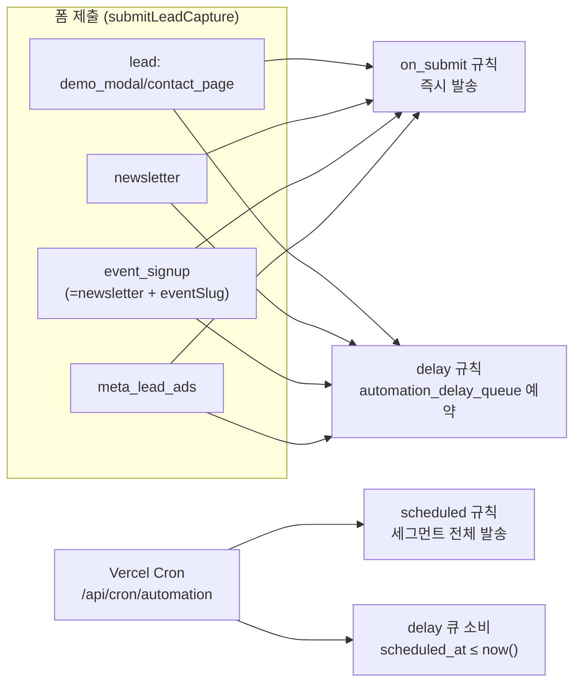
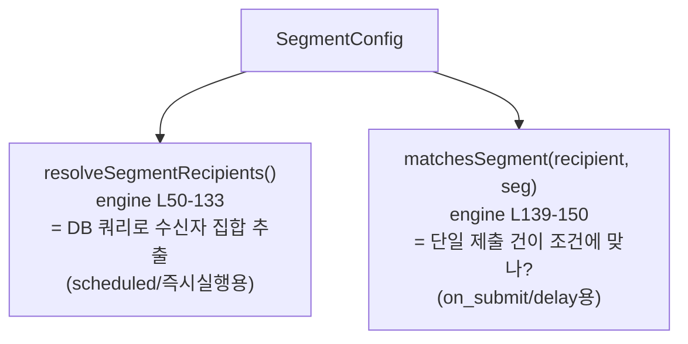
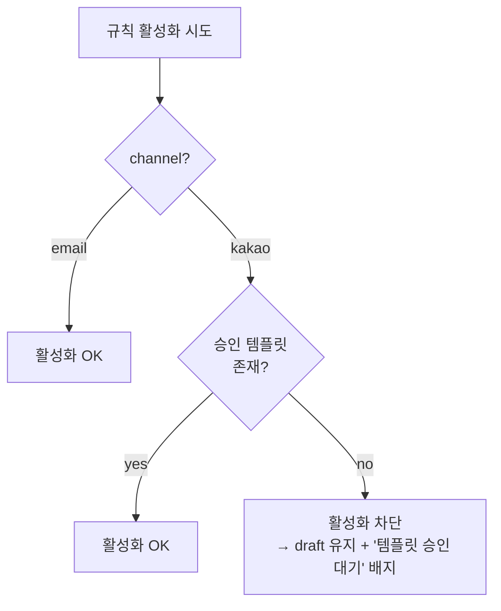
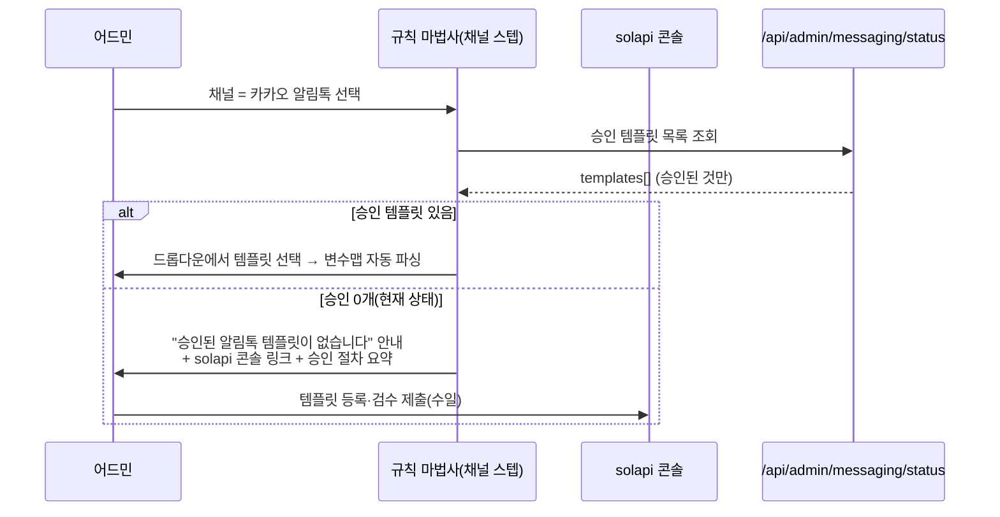
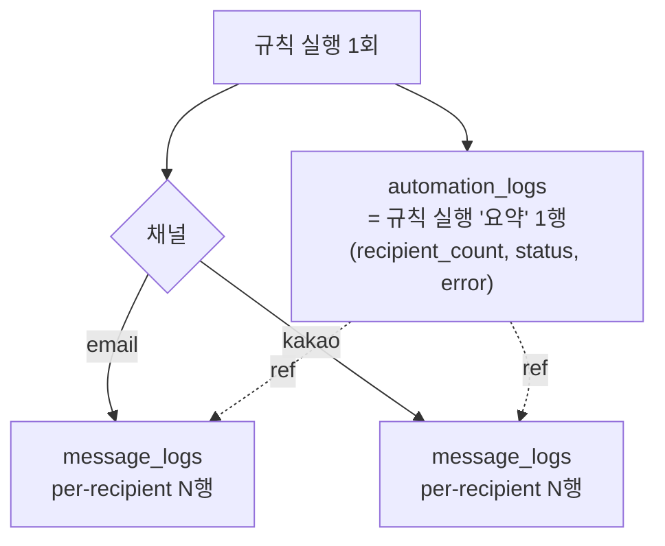
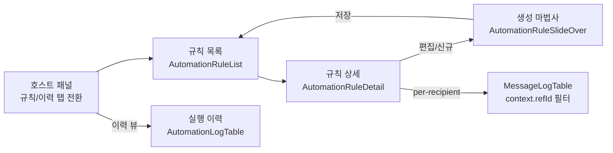

# 마케팅 자동 발송 자동화 설계 — 이메일 + 카카오 알림톡 통합

기준 시점: 2026-07-03
상태: 설계(시안) — 확정 대기. **본 문서는 설계안이며 구현 착수 전 검토·확정용이다.** 코드 변경 없음.
파트: 마케팅/그로스/CRM (Growth). 상위 청사진: [erp-blueprint-2026-06-22.md](erp-blueprint-2026-06-22.md)

관련 기존 문서:
- [MARKETING_EMAIL_SYSTEM.md](MARKETING_EMAIL_SYSTEM.md) — 이메일/구독자 시스템(선행)
- [messaging-solapi-setup-2026-07-03.md](messaging-solapi-setup-2026-07-03.md) — 발송 레이어(solapi) 백엔드 운영

---

## 0. 한 줄 결론

자동화 엔진·delay 큐·규칙 CRUD UI·발송 레이어(solapi/Resend)는 **이미 다 있다.** 새로 만드는 건 최소다.
이 설계의 핵심은 **"이메일 전용 엔진"을 "채널 선택 엔진(email | kakao_alimtalk)"으로 확장**하고, 자동화 발송을 `message_logs`로 통일 기록하며, **행사 신청(eventSlug)을 세그먼트가 인식**하게 만드는 것이다.

가장 먼저 풀어야 할 실존 제약 3가지(전부 코드로 확인됨):
- **카톡은 전화번호가 필요하다.** 그런데 on_submit 트리거는 현재 `email`만 넘긴다([lib/server/lead-capture.ts](../../lib/server/lead-capture.ts) L358). 데이터(leads.phone)는 있는데 배관이 막혀 있다.
- **승인된 알림톡 템플릿이 0개다.** ([messaging-solapi-setup](messaging-solapi-setup-2026-07-03.md) §알림톡 템플릿 승인) 카톡 규칙은 "승인 대기" 상태로 저장은 되되 발송은 템플릿 승인 후에만.
- **행사 신청은 별도 source가 아니다.** `source: "newsletter"` + `sourceDetail: "event_alert:{eventSlug}"`로 들어온다. 세그먼트 매칭은 `sources`만 보므로 행사 신청자를 구분하지 못한다.

---

## 1. 목표 · 스코프

### 1.1 목표

수신 동의한 리드/구독자에게, **규칙 기반으로 이메일과 카카오 알림톡을 자동 발송**한다. 리드→상담→행사→도입 퍼널의 각 단계에서 사람 손을 거치지 않고 즉시/예약 발송이 나가게 한다.

자동 발송의 실제 쓰임새:
- **리드 즉시 확인/안내** — 데모·문의 접수 즉시 "접수됐습니다" 카톡/메일
- **행사 신청 확인 + 리마인더** — 신청 확인 카톡, 행사 전날 D-1 리마인더
- **미응답 팔로업** — 상담 미응답 N일 후 이메일
- **자료 발송 후속** — 리드마그넷 다운로드 후 관련 자료·상담 제안

### 1.2 스코프 (확정 지시 반영)

| 채널 | 이번 라운드 | 비고 |
|------|-------------|------|
| **이메일** (`sendBatchEmail`, Resend 폴백) | ✅ 주력 | [lib/email.ts](../../lib/email.ts) — 이미 자동화 엔진이 사용 중 |
| **카카오 알림톡** (`sendKakaoAlimtalk`) | ✅ 주력 | [lib/messaging/send.ts](../../lib/messaging/send.ts) — 발송 계약 고정, 템플릿 승인 선행 |
| SMS/LMS (`sendSmsMessages`) | ⏸ 보류 | 폴백 채널로만 언급. 주력 아님. 알림톡 실패 시 `disableSms` 기본 true 유지 |
| 카카오 친구톡 | ⏸ 보류 | 마케팅성 발송 채널 후보 — §13 결정1 |

### 1.3 스코프 밖 (이번 라운드 제외)

- 크론 스케줄러 고도화(현 일간 cron + 23h 가드 그대로 사용)
- A/B 테스트, 오픈율 기반 분기, 멀티스텝 저니 빌더
- 친구톡/SMS 마케팅 캠페인 (별도 캠페인 화면 [SmsComposer](../../components/admin/marketing/SmsComposer.tsx)에서 이미 수동 발송 가능)

---

## 2. 트리거 Taxonomy

현재 엔진은 3종 트리거를 정의·구현하고 있다([lib/automation-types.ts](../../lib/automation-types.ts) L36-58).



### 2.1 트리거 3종 — 코드 근거

| 트리거 | 발화 시점 | 코드 근거 (file:line) | 현재 상태 |
|--------|-----------|----------------------|-----------|
| `on_submit` | 폼 제출 즉시 | 발화: [lead-capture.ts](../../lib/server/lead-capture.ts) L357-367 → `triggerOnSubmitRules` / 매칭·발송: [automation-engine.ts](../../lib/automation-engine.ts) L377-435 | 이메일만 발송 |
| `delay` | 제출 후 N시간 | 예약: [automation-engine.ts](../../lib/automation-engine.ts) L438-485 (`createDelayQueueItem`) / 소비: [cron/automation/route.ts](../../app/api/cron/automation/route.ts) L128-160 → `executeDelayQueueItem` | 이메일만 발송 |
| `scheduled` | cron(일간 09:00 UTC) | [cron/automation/route.ts](../../app/api/cron/automation/route.ts) L86-124, `isDue` 23h 가드 L38-64 → `executeRule` | 이메일만 발송 |

> 배경에서 확정된 "수리됨 전제": `executeDelayQueueItem`의 `automation_logs` 미기록 갭과 `triggerOnSubmitRules` 최상위 catch 무음 갭은 병렬 백엔드 작업으로 수리 중이다. 본 설계는 **로그 기록·에스컬레이션이 정상 동작한다는 전제**로 그린다. (현재 코드에는 이미 `emitNotificationEvent` 에스컬레이션이 L469, L490에 들어와 있음 — §9 참조)

### 2.2 `event_signup` 트리거 — 신설 설계 (현재 없음)

**현재 상태**: 행사 신청 전용 트리거·source는 **존재하지 않는다.** 행사 신청은 [EventAlertSignup](../../components/events) → `/api/newsletter/subscribe` → `submitLeadCapture({ source: "newsletter", sourceDetail: "event_alert:{eventSlug}" })`로 처리된다. `LeadSource` enum은 `demo_modal | contact_page | newsletter | meta_lead_ads`뿐이다([lib/lead-types.ts](../../lib/lead-types.ts) L1-5).

**문제**: `matchesSegment`([automation-engine.ts](../../lib/automation-engine.ts) L139-150)는 `seg.sources`만 검사한다. 행사 신청자는 전부 `source=newsletter`라서, "이 행사 신청자에게만" 확인 카톡을 보낼 방법이 없다.

**설계 (신설, source 추가 아님 — 세그먼트 필드 추가)**:
`event_signup`을 **별도 source로 만들지 않는다.** 대신 세그먼트에 `eventSlug` 인식 필드를 추가하고, on_submit payload가 `eventSlug`를 전달하게 한다.

- `SegmentConfig`에 필드 추가(설계): `eventSlugPrefix?: string` 또는 `hasEventSignup?: boolean`
  - `hasEventSignup: true` → `sourceDetail`이 `event_alert:`로 시작하는 제출만 매칭
  - `eventSlugPrefix: "webinar-2026-07"` → 특정 행사만 매칭
- on_submit payload 확장(설계): `triggerOnSubmitRules`에 `eventSlug`(또는 `sourceDetail`) 필드 전달 → `matchesSegment`가 검사
- UI: 트리거 스텝에 "행사 신청" 프리셋을 추가(내부적으로는 `on_submit` + `hasEventSignup` 세그먼트로 저장). 사용자에겐 4번째 트리거처럼 보이되, 엔진은 기존 `on_submit` 경로 재사용.

> 이 방식의 이점: 트리거 타입 enum·DB CHECK 제약·cron 로직을 건드리지 않고, 세그먼트 매칭만 확장한다. delay 규칙(D-1 리마인더)도 자동으로 `eventSlug`를 큐 항목에 실어 나른다.

---

## 3. 조건 / 세그먼트 매칭

### 3.1 현재 `SegmentConfig` 스키마 (코드 확인)

[lib/automation-types.ts](../../lib/automation-types.ts) L21-34 기준:

| 필드 | 타입 | 적용 대상 | 매칭 로직 |
|------|------|-----------|-----------|
| `sources` | `("demo_modal"\|"contact_page"\|"newsletter"\|"manual"\|"meta_lead_ads")[]` | 양쪽 | OR (빈 배열=전체) |
| `leadStatuses` | `("new"\|"contacted"\|"converted"\|"closed")[]` | leads only | IN |
| `tags` | `string[]` | subscribers only | overlaps(OR) — [PRESET_TAGS](../../lib/marketing-types.ts) L165 |
| `hasEmail` | `boolean` | 양쪽 | email 존재 여부 |
| `daysSinceSubmit` | `number\|null` | 양쪽 | `created_at >= now - N일` |
| `targetTable` | `"leads"\|"subscribers"\|"both"` | — | 조회 테이블 선택 |

### 3.2 두 가지 매칭 경로 (같은 SegmentConfig, 다른 실행)



- **scheduled / 어드민 즉시실행**: `resolveSegmentRecipients`가 `leads`+`newsletter_subscribers`를 조회해 dedupe(구독자 우선)한 수신자 배열을 만든다.
- **on_submit / delay**: `matchesSegment`가 방금 제출된 단일 recipient가 규칙 세그먼트에 부합하는지 판정한다. **현재 `matchesSegment`는 `sources`와 `hasEmail`만 검사** — `tags`/`leadStatuses`/`daysSinceSubmit`는 무시(제출 시점엔 태그·상태가 없으니 설계상 자연스러움).

### 3.3 설계 확장 (채널·행사 인식)

세그먼트에 추가할 필드(설계):

| 신규 필드 | 목적 | 매칭 위치 |
|-----------|------|-----------|
| `hasEventSignup?: boolean` / `eventSlugPrefix?: string` | 행사 신청자 구분(§2.2) | `matchesSegment` + `resolveSegmentRecipients` |
| `hasPhone?: boolean` | 카톡 발송 가능(전화번호 보유) 대상만 | 양쪽 — 카톡 채널 규칙의 **필수 게이트** |

> **핵심 규칙**: 채널이 `kakao_alimtalk`인 규칙은 세그먼트에서 자동으로 `hasPhone`을 강제한다. 전화번호 없는 수신자는 카톡 대상에서 제외하고(폴백 정책은 §4.4), 어드민 세그먼트 미리보기에 "카톡 발송 가능 N명 / 전화번호 없음 M명"을 분리 표기한다.

---

## 4. 채널 추상화 설계

### 4.1 통일 인터페이스 — 규칙이 채널을 선택

현재 `AutomationRule`은 채널 개념이 없다(항상 이메일). 규칙에 **채널 선택자**를 추가한다(설계).

```
AutomationRule.channel: "email" | "kakao_alimtalk"        // 신규
AutomationRule.templateId: string                          // email → email_templates.id
AutomationRule.kakaoTemplateId?: string                    // kakao → solapi 승인 템플릿 ID
AutomationRule.kakaoVariableMap?: Record<string,string>    // kakao 변수 바인딩 (§5)
```

발송 시 엔진 내부에서 채널로 분기하는 **단일 디스패치 함수**(설계):

```
dispatchAutomationMessage(rule, recipient, ctx) →
  if rule.channel === "email":
    sendBatchEmail([{ to: recipient.email, subject, html }])       // 기존 경로 그대로
  if rule.channel === "kakao_alimtalk":
    sendKakaoAlimtalk({ to: recipient.phone!, templateId, variables, context })
  → 두 경로 모두 결과를 통일 로그 모델(§8)로 기록
```

> 구현 주의(강결합 회피): `automation-engine.ts`·`messaging/**`는 병렬 편집 중이므로, 이 디스패처는 **공개 계약**(`sendBatchEmail(SingleEmail[])`, `sendKakaoAlimtalk(SendAlimtalkParams)`)만 호출한다. 내부 구현 세부에 의존하지 않는다.

### 4.2 채널별 필수 조건

| 채널 | 수신자 필수 | 콘텐츠 필수 | 발송 전 게이트 |
|------|-------------|-------------|----------------|
| `email` | `recipient.email` | 제목(subject) + HTML(body) — `email_templates` | 없음(항상 가능) |
| `kakao_alimtalk` | `recipient.phone` (`hasPhone` 세그먼트) | 승인된 `templateId` + 변수맵 | **템플릿 승인 완료** ([messaging-solapi-setup](messaging-solapi-setup-2026-07-03.md) §승인). 미승인 시 규칙은 저장되나 `paused` 강제 |

### 4.3 발송 가능 여부 판정 (규칙 활성화 게이트)



카톡 규칙은 [GET /api/admin/messaging/status](messaging-solapi-setup-2026-07-03.md)의 `templates`(승인 목록)로 `kakaoTemplateId` 유효성을 검증한 뒤에만 `active` 전환을 허용한다.

### 4.4 이메일 ↔ 카톡 폴백 / 우선순위 정책 (제안)

세 가지 정책 옵션 — **§13 결정3에서 확정**:

| 정책 | 동작 | 장점 | 단점 |
|------|------|------|------|
| **A. 단일 채널** (권장 기본) | 규칙당 채널 1개. 폴백 없음 | 단순·예측가능·비용 명확 | 카톡 실패 시 그 수신자 누락 |
| **B. 카톡 우선 + 이메일 폴백** | 카톡 발송, 전화번호 없거나 실패 시 이메일 | 도달률 최대 | 이중 템플릿 관리, 로그 복잡 |
| **C. 동시 발송** | 카톡 + 이메일 둘 다 | 확실한 도달 | 사용자 피로·중복, 비용 2배 |

> 발송 레이어의 `disableSms` 기본 true는 **알림톡→SMS** 자동 대체를 막는다. 알림톡→이메일 폴백은 solapi가 아니라 우리 엔진이 오케스트레이션해야 한다(정책 B 선택 시 디스패처가 처리).

---

## 5. 템플릿 바인딩

### 5.1 두 템플릿 저장소 — 병존

| 채널 | 저장소 | 변수 문법 | 승인 |
|------|--------|-----------|------|
| email | `email_templates` (Supabase, [20260326_automation.sql](../../supabase/migrations/20260326_automation.sql)) | `{name}` `{org}` `{role}` … | 불필요 |
| kakao | solapi 원격(우리 DB에 저장 안 함, `templateId`만 규칙에 보관) | `#{변수명}` (solapi 문법) | **카카오 검수 필수** |

### 5.2 변수 치환 규칙 통일

현재 이메일 개인화 변수([automation-engine.ts](../../lib/automation-engine.ts) `personalizeBody` L229-245):
`{name}` `{org}` `{role}` `{email}` `{phone}` `{academy_size}` `{date}` `{unsubscribe_url}` (+ `{ai: 프롬프트}` AI 블록 L195-218).

**통일 변수 사전(설계)** — 한 곳에서 정의하고 채널별로 문법만 렌더:

| 논리 변수 | 이메일 표기 | 카톡 표기 | 값 소스 (AutomationRecipient) |
|-----------|-------------|-----------|-------------------------------|
| 이름 | `{name}` | `#{name}` | `recipient.name ?? "고객"` |
| 학원명 | `{org}` | `#{org}` | `recipient.org` |
| 직책 | `{role}` | `#{role}` | `recipient.role` |
| 학원규모 | `{academy_size}` | `#{academy_size}` | `recipient.size` |
| 발송일 | `{date}` | `#{date}` | 오늘(ko-KR) |
| 행사명/일시 | `{event_name}` | `#{event_name}` | eventSlug→행사 조회(신규) |

- `kakaoVariableMap`은 solapi 템플릿의 `#{키}`를 위 논리 변수에 매핑한다. 예: `{ "고객명": "name", "학원": "org" }`.
- **카톡에는 `{unsubscribe_url}`·`{ai:}` 블록을 쓰지 않는다.** 알림톡은 정형 템플릿이고 AI 자유생성·수신거부 링크는 검수 정책과 충돌한다. AI 블록은 이메일 전용으로 유지.

### 5.3 카톡 템플릿 승인 워크플로 → 규칙 생성 UX 통합



- 규칙 마법사의 채널 스텝은 `/api/admin/messaging/status`의 `templates`를 그대로 드롭다운에 채운다(원격 60s 캐시 존재).
- 승인 0개일 때 규칙은 **초안 저장만 허용**하고, 승인 후 활성화하도록 유도(§4.3 게이트와 동일).

---

## 6. 타이밍 / 지연

### 6.1 delay 큐 재사용 (스키마 무변경)

`automation_delay_queue`([20260413_delay_queue.sql](../../supabase/migrations/20260413_delay_queue.sql))를 채널 무관하게 그대로 쓴다. 큐 항목은 `rule_id` + `recipient_data`(JSONB)를 담으므로, 규칙의 채널·전화번호가 자동으로 따라온다. **cron 소비 로직 변경 불필요** — `executeDelayQueueItem`이 규칙 채널로 분기(§4.1)하도록만 확장.

### 6.2 카톡 발송 시간대 정책

알림톡은 정보성(예: 신청 확인, 리마인더)은 야간 발송이 가능하지만, **마케팅성은 08:00~20:00 권장**(정보통신망법·카카오 정책 관행).

| 발송 성격 | 시간대 창 | 창 밖 도착 시 |
|-----------|-----------|---------------|
| 정보성(확인/리마인더) | 제한 없음(즉시) | 즉시 발송 |
| 마케팅성(프로모션/뉴스) | 08:00~20:00 KST | 다음 08:00으로 재예약(delay 큐 scheduled_at 조정) |

- 규칙에 `messageCategory: "info" | "marketing"` 플래그 추가(설계). 카톡 + `marketing` + 창 밖 → 발송을 다음 08:00로 미룬다.
- on_submit 즉시 발송이라도 카톡·마케팅성이면 이 창을 적용(정보성 확인 카톡은 예외로 즉시).

> cron은 하루 1회(09:00 UTC = 18:00 KST)라 delay 큐 소비 시각이 창을 벗어날 수 있다. 시간대 창을 실효화하려면 **§12 Phase 2에서 cron 빈도 상향** 또는 발송 직전 창 체크로 다음 창 재예약. 초기엔 "정보성만 카톡, 마케팅성은 이메일"로 단순화 가능(§13 결정1과 연동).

---

## 7. 멱등성 / 중복방지

### 7.1 참고 패턴 — lead_alert_states

[20260604_lead_response_alert_states.sql](../../supabase/migrations/20260604_lead_response_alert_states.sql)는 `UNIQUE(scope, subject_id, alert_key)`로 "같은 알림을 매 스캔마다 반복 발송"을 막는다. 자동화 발송도 동일 패턴을 쓴다.

### 7.2 중복방지 키

**멱등 키 = `rule_id + recipient(email/phone) + trigger_instance`**

| 트리거 | trigger_instance 정의 | 중복 위험 | 방어 |
|--------|----------------------|-----------|------|
| on_submit | 제출 1건(리드 id 또는 email+source+created_at) | 동일 제출이 재시도로 2회 발화 | 리드 캡처의 60초 중복창([lead-capture.ts](../../lib/server/lead-capture.ts))이 1차 방어. 추가로 `(rule_id, recipient, lead_id)` 키 |
| delay | 큐 항목 id | 큐 항목이 2회 처리(cron 중복 실행) | 큐 `status=pending`→`sent` 전이가 방어. `updateDelayItemStatus` |
| scheduled | 규칙+발송일(YYYY-MM-DD) | 하루에 2회 발송 | cron `isDue` 23h 가드([cron/route.ts](../../app/api/cron/automation/route.ts) L38-64) |

### 7.3 신규 dedupe 테이블 (설계, `[MIG]`)

기존 `automation_logs`만으로는 per-recipient 멱등을 보장하기 어렵다(로그는 요약 중심). 카톡은 과금이 있으므로 **발송 전 멱등 체크**가 중요하다.

```sql
-- 설계안: automation_send_dedupe (lead_alert_states 패턴)
CREATE TABLE automation_send_dedupe (
  rule_id       UUID NOT NULL,
  recipient_key TEXT NOT NULL,   -- email 또는 정규화 phone
  trigger_key   TEXT NOT NULL,   -- lead_id / queue_id / 'YYYY-MM-DD'
  channel       TEXT NOT NULL,
  sent_at       TIMESTAMPTZ NOT NULL DEFAULT now(),
  UNIQUE (rule_id, recipient_key, trigger_key, channel)
);
```

디스패처는 발송 직전 이 키를 INSERT 시도 → 충돌(이미 존재)이면 **skip**. 이메일도 동일 적용하면 재시도 안전.

---

## 8. 로깅 통일 모델

### 8.1 두 테이블의 역할 분담



| 테이블 | 알갱이 | 무엇을 남기나 | 근거 |
|--------|--------|---------------|------|
| `automation_logs` | 규칙 실행 1회 | 언제 어떤 규칙이 몇 명에게 성공/실패했는지 **요약** | [20260326_automation.sql](../../supabase/migrations/20260326_automation.sql) L34 |
| `message_logs` | 수신자 1명 1건 | 채널·수신자·상태(sent/failed/simulated)·solapi 상태코드·context | [20260703_message_logs.sql](../../supabase/migrations/20260703_message_logs.sql) |

### 8.2 통일 규칙

- **모든 자동화 발송은 `message_logs`에 per-recipient로 기록**한다.
  - 카톡: `sendKakaoAlimtalk`이 자동으로 기록(이미 구현, [send.ts](../../lib/messaging/send.ts) L315 `logResults`).
  - 이메일: 현재 `sendBatchEmail`은 `message_logs`에 기록하지 **않는다**(Resend 경로). → 디스패처가 이메일 발송 후 `channel:"email"`로 `message_logs`에 per-recipient 기록을 **추가**한다. (설계 — `insertMessageLogs` 재사용)
- **`context`에 자동화 출처를 심는다**: `{ source: "automation", refId: rule_id, trigger: "on_submit"|"delay"|"scheduled", logId: automation_log_id }`. PII(전화·이메일)는 `context`에 넣지 않는다(recipient 컬럼에 별도 저장, 응답 시 마스킹).
- `automation_logs.id`를 `message_logs.context.logId`로 연결 → 규칙 요약 ↔ per-recipient 드릴다운.

### 8.3 어드민 조회

- 규칙 상세의 "최근 실행"([AutomationRuleDetail](../../components/admin/marketing/AutomationRuleDetail.tsx) L178-208)·실행 이력 탭([AutomationLogTable](../../components/admin/marketing/AutomationLogTable.tsx))은 `automation_logs`(요약)를 계속 사용.
- per-recipient 드릴다운(카톡 실패 상태코드 등)은 [MessageLogTable](../../components/admin/marketing/MessageLogTable.tsx)(`message_logs`, 이미 구현됨)를 재사용해 규칙 상세에서 필터(`context.refId = rule_id`)로 연다.

---

## 9. 실패 에스컬레이션

### 9.1 기존 이벤트 인프라 재사용

[lib/notifications/emit-event.ts](../../lib/notifications/emit-event.ts) `emitNotificationEvent`가 in-app + WeCom 웹훅으로 알림을 승격한다. 카테고리 enum에 `marketing`, 채널에 `kakao_alimtalk`이 이미 있다([notifications/types.ts](../../lib/notifications/types.ts) L19, L38).

현재 자동화 경로에 **이미 들어와 있는** 에스컬레이션(수리 결과):
- `automation.delay_enqueue_failed` — 예약 큐 삽입 실패 → warning ([automation-engine.ts](../../lib/automation-engine.ts) L469-479)
- `automation.on_submit_failed` — on_submit 전체 실패 → critical ([automation-engine.ts](../../lib/automation-engine.ts) L490-499)

### 9.2 추가 에스컬레이션 (설계)

| 이벤트 타입(신규) | notificationType | severity | 트리거 조건 |
|-------------------|------------------|----------|-------------|
| `automation.send_failed` | `incident` | warning | 규칙 실행에서 **전체 실패**(sent=0, failed>0). email·kakao 공통 |
| `automation.kakao_template_missing` | `warning` | warning | 카톡 규칙 활성 상태인데 승인 템플릿이 사라짐(검수 취소/만료) |
| `automation.kakao_balance_low` | `warning` | warning | solapi 잔액 부족으로 카톡 접수 실패(status 응답 근거) |

- 전부 `categoryTag: "marketing"`, `source: "automation"`, `sourceId: rule_id`.
- **무음 실패 금지 원칙**(리드 무결성)과 동일 선상: 카톡은 과금·도달이 걸리므로 전체 실패는 반드시 알림으로 승격.

---

## 10. 어드민 CRUD UX 흐름

### 10.1 현재 상태 — 4개 규칙 컴포넌트 + 유동 중인 호스트

4개 규칙 컴포넌트는 완성도 높은 **내구 자산**이다: 규칙 목록·상세·마법사·로그 테이블이 모두 구현돼 있고 대응 API(`/api/admin/automation/*`)와 계약이 맞는다.

- [AutomationRuleList](../../components/admin/marketing/AutomationRuleList.tsx) — 좌측 규칙 목록(검색·상태 필터·마지막 실행)
- [AutomationRuleDetail](../../components/admin/marketing/AutomationRuleDetail.tsx) — 우측 규칙 상세(트리거/세그먼트/템플릿/즉시실행/토글)
- [AutomationRuleSlideOver](../../components/admin/marketing/AutomationRuleSlideOver.tsx) — 3스텝 생성/편집 마법사
- [AutomationLogTable](../../components/admin/marketing/AutomationLogTable.tsx) — 실행 이력(요약)

**호스트(4개를 묶어 `/admin/marketing`의 `automation` 탭에 마운트하는 패널)는 현재 병렬 리팩터로 유동 중**이다(작업 도중 생성·제거가 관찰됨). 따라서 이 설계는 호스트의 최종 형태를 특정 파일에 못 박지 않는다. 요지: **호스트가 어떻게 배선되든, 4개 규칙 컴포넌트는 그대로 살리고 채널 스텝/뱃지만 보강**한다. 호스트는 `adminFetch`로 rules/logs/templates를 로드하고, `handleSave` payload에 채널 필드(§10.4)를 실어 `POST/PATCH /rules`에 보내면 된다.

> 즉 이번 작업은 "신규 배선"이 아니라 "채널 인식 보강"이다. 신설 UI는 KakaoTemplatePicker 1개뿐(§10.4).

### 10.2 화면 흐름



### 10.3 생성 마법사 스텝 매핑 (기존 3스텝 → 채널 스텝 추가)

현재 [AutomationRuleSlideOver](../../components/admin/marketing/AutomationRuleSlideOver.tsx)는 3스텝(트리거 L200 → 세그먼트 L304 → 템플릿 L425)이고 **이메일 전용**이다.

**설계: 채널 스텝을 세그먼트와 템플릿 사이에 삽입 → 4스텝**

| 스텝 | 내용 | 재활용 컴포넌트 | 보강 |
|------|------|-----------------|------|
| 1. 트리거 | on_submit/scheduled/delay + **행사신청 프리셋(신규)** | AutomationRuleSlideOver Step1 (L200-302) | 행사신청 옵션 추가(§2.2), cron/delay 프리셋 그대로 |
| 2. 세그먼트 | 대상 테이블·source·태그·기간 + 미리보기 | AutomationRuleSlideOver Step2 (L304-423) | `hasEventSignup`/`hasPhone` 조건 + 미리보기에 "카톡 가능 N명" 분리 |
| **3. 채널·템플릿 (신규 통합)** | **채널 선택(email/kakao)** → 채널별 템플릿 | Step3(L425)을 확장 | email이면 `email_templates` 드롭다운(기존), kakao면 승인 템플릿 드롭다운 + 변수맵 |
| 4. 타이밍·검토·활성화 | delay 시간/시간대창 + 초안·활성화 | Step3 하단(L488-514) 분리 | 카톡+마케팅성이면 시간대창 안내, 승인 없으면 활성화 잠금(§4.3) |

### 10.4 컴포넌트 → 화면 매핑 요약

| 컴포넌트 (경로) | 담당 화면 | 이번 보강 |
|-----------------|-----------|-----------|
| [AutomationRuleList](../../components/admin/marketing/AutomationRuleList.tsx) | 좌측 규칙 목록 | 카드에 **채널 아이콘**(메일/말풍선) + "승인 대기" 뱃지 추가 |
| [AutomationRuleDetail](../../components/admin/marketing/AutomationRuleDetail.tsx) | 우측 규칙 상세 | "이메일 템플릿" 섹션(L162-176)을 **채널별 표시**로. 카톡이면 templateId+변수 표시 |
| [AutomationRuleSlideOver](../../components/admin/marketing/AutomationRuleSlideOver.tsx) | 생성/편집 마법사 | 3→4스텝(채널 스텝 삽입, §10.3) |
| [AutomationLogTable](../../components/admin/marketing/AutomationLogTable.tsx) | 실행 이력(요약) | 채널 컬럼 추가(automation_logs에 channel 표기 시) |
| 호스트 패널(유동 중, §10.1) | 위 전부의 호스트 (`/admin/marketing` automation 탭) | `handleSave` payload에 channel/kakaoTemplateId 추가 |

**부족해서 신설할 컴포넌트**:
- **KakaoTemplatePicker** (신규) — `/api/admin/messaging/status`의 승인 템플릿을 불러와 선택 + `#{변수}` 자동 파싱 → 변수맵 UI. (마법사 채널 스텝에서 사용. [KakaoComposer](../../components/admin/marketing/KakaoComposer.tsx)의 템플릿 선택 로직을 참고·추출)
- per-recipient 드릴다운은 기존 [MessageLogTable](../../components/admin/marketing/MessageLogTable.tsx) 재사용(신설 불필요).

---

## 11. 레시피 프리셋 (4~5개)

클래스인 실제 퍼널 시나리오. 어드민 마법사에 "프리셋에서 시작"으로 노출.

### R1. 리드 제출 즉시 확인 카톡
| 항목 | 값 |
|------|-----|
| 트리거 | `on_submit` |
| 조건 | source ∈ {demo_modal, contact_page}, `hasPhone` |
| 채널 | kakao_alimtalk (정보성) |
| 템플릿 | "접수 확인" — `#{name}님, 데모 신청이 접수되었습니다…` |
| 타이밍 | 즉시(정보성 → 시간대창 예외) |
| 폴백 | 전화번호 없으면 이메일 확인 메일(정책 B) 또는 skip(정책 A) |

### R2. 행사 신청 확인 + D-1 리마인더 (2개 규칙 세트)
| 항목 | 규칙 2a (확인) | 규칙 2b (리마인더) |
|------|----------------|--------------------|
| 트리거 | `on_submit` + 행사신청 프리셋 | `delay` + 행사신청 프리셋 |
| 조건 | `hasEventSignup`(sourceDetail=event_alert:*), `hasPhone` | 동일 + 행사 D-1 타이밍 |
| 채널 | kakao_alimtalk (정보성) | kakao_alimtalk (정보성) |
| 템플릿 | "행사 신청 확인" `#{event_name} #{date}` | "행사 리마인더" `내일 #{event_name}…` |
| 타이밍 | 즉시 | 행사 전날(delay 큐, scheduled_at=행사−1일) |

> 참고: D-1 리마인더는 delay 트리거의 "제출 후 N시간"과 성격이 다르다(고정 시각 아님). 행사일 기준 역산이 필요하므로, delay 트리거를 **"이벤트 기준일 −N일"** 모드로 확장하거나(설계), 초기엔 scheduled 규칙 + eventSlug 필터로 대체.

### R3. 상담 미응답 3일 후 이메일 팔로업
| 항목 | 값 |
|------|-----|
| 트리거 | `delay` (72시간) 또는 `scheduled`(일간) + `daysSinceSubmit` |
| 조건 | targetTable=leads, leadStatus=new(미연락), source ∈ {demo_modal, contact_page} |
| 채널 | email |
| 템플릿 | "아직 상담 전이신가요?" + 재예약 CTA |
| 타이밍 | 제출 72h 후 / 또는 scheduled 매칭 |
| 비고 | scheduled면 `resolveSegmentRecipients`의 leadStatus 필터로 "3일 지났는데 아직 new"를 매일 스윕 |

### R4. 자료 다운로드 후 후속 카톡
| 항목 | 값 |
|------|-----|
| 트리거 | `on_submit` (source=newsletter, leadMagnet 존재) |
| 조건 | sourceDetail=lead_magnet:*, `hasPhone` |
| 채널 | kakao_alimtalk (정보성 경계 — 자료 안내) |
| 템플릿 | "요청하신 자료입니다 + 도입 상담 제안" |
| 타이밍 | 즉시 또는 delay 1h |

### R5. 뉴스레터 구독 환영 (기존 웰컴 대체/보강)
| 항목 | 값 |
|------|-----|
| 트리거 | `on_submit` (source=newsletter, 행사·자료 아님) |
| 조건 | targetTable=subscribers |
| 채널 | email (마케팅성) |
| 템플릿 | 환영 + 클래스인 소개 |
| 타이밍 | 즉시 |

---

## 12. 구현 단계 Phase 0/1/2

> 효과/노력: **S**=하루 이내, **M**=수일. `[MIG]`=마이그레이션 필요.

### Phase 0 — 배관 개통 (병렬 작업과의 접점)
현재 병렬로 진행 중: (a) `messaging/**` 발송 레이어, (b) `automation-engine.ts`/delay 로그·에스컬레이션 수리, (c) 규칙 컴포넌트 호스트 패널 배선(§10.1, 유동 중). **Phase 0는 이 셋 위에 최소 배관만 연결.**

- [ ] **(S) on_submit payload에 phone·eventSlug 전달** — [lead-capture.ts](../../lib/server/lead-capture.ts) L357의 게이트를 `if (body.email || body.phone)`로, payload에 `phone`/`eventSlug` 추가. *`automation-engine.ts` 편집 중인 백엔드 에이전트와 조율(같은 함수).*
- [ ] **(S) `matchesSegment`에 `hasPhone`·`hasEventSignup` 추가** — [automation-engine.ts](../../lib/automation-engine.ts) L139-150. sourceDetail 검사 추가.
- [ ] **(S) 이메일 발송도 `message_logs` 기록** — 디스패처가 `sendBatchEmail` 후 `insertMessageLogs(channel:"email")` 호출. 로깅 통일(§8.2).

### Phase 1 — 채널 선택 엔진 + 카톡 발송
- [ ] **(M) 규칙에 channel/kakaoTemplateId/kakaoVariableMap 추가** `[MIG]` — `automation_rules` ALTER + `AutomationRule` 타입 확장. 마이그레이션 필수(무음 실패 방지, MEMORY 규칙).
- [ ] **(M) `dispatchAutomationMessage` 디스패처** — 채널 분기(§4.1). `executeRule`/`executeDelayQueueItem`/`triggerOnSubmitRules` 3경로가 공통 호출.
- [ ] **(M) 마법사 채널 스텝 + KakaoTemplatePicker** — 3→4스텝(§10.3), 신규 컴포넌트 1개.
- [ ] **(S) 활성화 게이트** — 카톡 규칙은 승인 템플릿 검증 후에만 active(§4.3).
- [ ] **(S) 멱등 dedupe 테이블** `[MIG]` — `automation_send_dedupe`(§7.3). 카톡 과금 안전.

### Phase 2 — 타이밍·에스컬레이션·정교화
- [ ] **(M) 시간대 창 정책** — 카톡+마케팅성 08~20시 재예약(§6.2). cron 빈도 상향 검토.
- [ ] **(S) 실패 에스컬레이션 3종** — `automation.send_failed` 등(§9.2).
- [ ] **(M) 행사 기준일 −N일 delay 모드** — R2 D-1 리마인더 정식화(§11 R2 비고).
- [ ] **(S) 레시피 프리셋 5종** — 마법사 "프리셋에서 시작"(§11).

---

## 13. 확정 필요 결정 3개

> 아래는 사용자 판단이 필요한 진짜 갈림길이다. 각 옵션의 트레이드오프와 추천안을 함께 제시한다.

### 결정 1 — 마케팅성 발송에 무엇을 쓰나: 알림톡 vs 친구톡 vs 이메일

알림톡은 **정보성**(거래·안내) 원칙이라 순수 프로모션에 부적합할 수 있다. 프로모션은 친구톡(마케팅 수신동의 필요) 또는 이메일이 정석.

| 옵션 | 내용 | 트레이드오프 |
|------|------|--------------|
| **A. 카톡=정보성만, 마케팅성=이메일** (추천) | 확인·리마인더·자료안내만 알림톡. 프로모션·뉴스는 이메일 | 정책 리스크 최소·단순. 카톡 마케팅 도달은 포기 |
| B. 친구톡 도입 | 마케팅성도 카톡(친구톡) | 마케팅 수신동의·친구 추가 필요, 별도 채널 셋업. 이번 스코프(알림톡)와 별개 |
| C. 알림톡으로 마케팅성까지 | 전부 알림톡 | 템플릿 반려·계정 제재 리스크 |

**추천: A.** 이번 라운드는 "카톡=정보성 알림, 마케팅성=이메일"로 명확히 분리. 친구톡은 후속.

### 결정 2 — 카톡 마케팅성 발송 시간대 정책

| 옵션 | 내용 | 트레이드오프 |
|------|------|--------------|
| **A. 정보성=즉시, 마케팅성=08~20시 재예약** (추천) | 성격별 창 분리(§6.2) | 안전·관행 준수. 재예약 로직 필요(delay 큐) |
| B. 전부 즉시 | 시간대 무시 | 단순하나 야간 마케팅 발송 리스크 |
| C. 전부 08~20시 | 정보성도 창 적용 | 신청 확인이 지연돼 UX 저하 |

**추천: A.** 단, 결정1에서 A를 택하면 "카톡 마케팅성" 자체가 없어져 이 결정은 자동 단순화(정보성 즉시 + 이메일 무제한). 그 경우 창 로직은 Phase 2로 미룰 수 있음.

### 결정 3 — 이메일·카톡 동시발송 vs 폴백 (§4.4)

| 옵션 | 내용 | 트레이드오프 |
|------|------|--------------|
| **A. 단일 채널(폴백 없음)** (추천 기본) | 규칙당 1채널 | 단순·비용명확·예측가능. 카톡 실패 시 그 수신자 누락 |
| B. 카톡 우선 + 이메일 폴백 | 전화번호 없거나 카톡 실패 시 이메일 | 도달률 최대. 이중 템플릿·로그 복잡, 엔진이 폴백 오케스트레이션 |
| C. 동시발송 | 둘 다 | 확실한 도달. 사용자 피로·중복, 비용/관리 2배 |

**추천: A로 시작.** 규칙당 채널 1개로 단순하게 출발하고, 도달률 데이터를 본 뒤 핵심 규칙(예: R1 리드 확인)만 선택적으로 B로 승격. C(동시)는 지양.

---

## 부록 A — 재활용 자산 인벤토리 (신규 최소화 원칙)

| 자산 | 경로 | 재활용 방식 |
|------|------|-------------|
| 자동화 엔진 | [lib/automation-engine.ts](../../lib/automation-engine.ts) | 채널 디스패처만 추가, 3트리거 경로 유지 |
| 타입 | [lib/automation-types.ts](../../lib/automation-types.ts) | channel·kakao 필드 확장 |
| delay 큐 | [20260413_delay_queue.sql](../../supabase/migrations/20260413_delay_queue.sql) | 스키마 무변경 재사용 |
| cron | [app/api/cron/automation/route.ts](../../app/api/cron/automation/route.ts) | 로직 유지(디스패처가 채널 분기) |
| 이메일 발송 | [lib/email.ts](../../lib/email.ts) `sendBatchEmail` | 그대로. 발송 후 message_logs 기록만 추가 |
| 카톡/SMS 발송 | [lib/messaging/send.ts](../../lib/messaging/send.ts) | 공개 계약 호출(`sendKakaoAlimtalk`) |
| per-recipient 로그 | [20260703_message_logs.sql](../../supabase/migrations/20260703_message_logs.sql) | 이메일·카톡 공통 기록소 |
| 에스컬레이션 | [lib/notifications/emit-event.ts](../../lib/notifications/emit-event.ts) | marketing 카테고리로 발송 실패 승격 |
| 규칙 CRUD UI | [AutomationRuleSlideOver](../../components/admin/marketing/AutomationRuleSlideOver.tsx) 외 3종 + 호스트 패널(§10.1) | 채널 스텝/뱃지만 보강 |
| 규칙 API | [app/api/admin/automation/](../../app/api/admin/automation) | 요청 스키마에 channel 필드 확장 |

**신설 대상(최소)**: `automation_send_dedupe` 테이블 1개, `KakaoTemplatePicker` 컴포넌트 1개, `dispatchAutomationMessage` 함수 1개, 세그먼트/규칙 필드 확장. 그 외는 전부 기존 자산 재활용.

---

## 부록 B — 준수 철칙 체크 (Growth 파트)

- **리드 무결성**: 자동화 발송 전체 실패는 무음 금지 → `emitNotificationEvent`로 승격(§9).
- **동의 게이팅**: 마케팅성 발송은 `marketingConsent`/수신동의 확인 후. 카톡 친구톡 도입 시 마케팅 수신동의 필수(결정1 B).
- **PII**: `message_logs.context`에 전화·이메일 미저장(recipient 컬럼 별도, 응답 마스킹). raw IP 무관.
- **어드민 API**: 규칙/템플릿 API는 `verifyAdmin()` 유지(확인됨, [rules/route.ts](../../app/api/admin/automation/rules/route.ts) L6,L18).
- **마이그레이션 필수**: 규칙 channel 컬럼·dedupe 테이블은 마이그레이션 없이 코드만 추가 시 INSERT 무음 실패(MEMORY 규칙).
- **검증 게이트**: `npx eslint app components lib --max-warnings=0` && `npm run build`.
