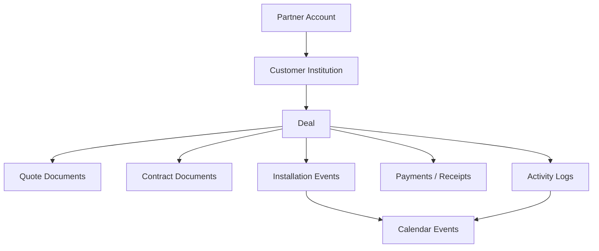

# Partner Portal Master Spec

기준 시점: 2026-04-04

이 문서는 파트너 운영과 파트너 포털의 현재 `단일 진입 문서`다.
운영 규칙, 화면 구조, 레이아웃, 탭 내용, 상태 전환 UX, 구현 방향을 한 번에 묶는다.

보조 문서:

- [partner-portal-guidelines.md](C:/Projects/PUBLIC_Classin/Classin_Home_bae_v1/docs/active/partner-portal-guidelines.md)
- [partner-portal-product-plan.md](C:/Projects/PUBLIC_Classin/Classin_Home_bae_v1/docs/active/partner-portal-product-plan.md)
- [partner-portal-screen-layout.md](C:/Projects/PUBLIC_Classin/Classin_Home_bae_v1/docs/active/partner-portal-screen-layout.md)
- [partner-portal-front-back-contract.md](C:/Projects/PUBLIC_Classin/Classin_Home_bae_v1/docs/active/partner-portal-front-back-contract.md)
- [partner-portal-implementation-roadmap.md](C:/Projects/PUBLIC_Classin/Classin_Home_bae_v1/docs/active/partner-portal-implementation-roadmap.md)
- [partner-portal-worklog.md](C:/Projects/PUBLIC_Classin/Classin_Home_bae_v1/docs/active/partner-portal-worklog.md)

문서 우선순위:

1. 이 문서
2. 운영 규칙은 `partner-portal-guidelines.md`
3. 화면/UX는 `partner-portal-product-plan.md`, `partner-portal-screen-layout.md`, `partner-portal-front-back-contract.md`
4. 개발 순서는 `partner-portal-implementation-roadmap.md`

## 1. 제품 한 줄 정의

파트너 포털은 `파트너사 대표와 ClassIn 팀을 위한 거래 운영 워크스페이스`다.

이 포털은 단순 문서함이 아니다.
핵심은 아래 흐름을 한 맥락에서 관리하는 것이다.

- 고객 기관 관리
- 거래건 진행 상태 추적
- 견적서/계약서 버전 관리
- 설치 일정 생성과 수정
- 분할 입금, 영수증, 미수금 관리
- 활동 로그와 미팅 로그 축적

## 2. 사용자와 역할

### A. 파트너사 대표

- 로그인 주체는 `대표 1인`
- 여러 고객 기관과 여러 거래건을 직접 운영
- 포털 내부에서는 설치 일정 수정/확정 권한을 가진다
- 모든 변경은 로그로 남는다

### B. ClassIn 팀

- 동일 데이터를 관리자 워크스페이스에서 본다
- 버전 이력, 공유 링크, 수납/설치/로그를 더 넓은 운영 관점에서 관리한다

### C. 고객

- 로그인 사용자가 아니다
- 문서는 `버전 고정 링크` 또는 `PDF`로만 본다
- 견적서와 계약서 모두 `링크가 가리키는 해당 버전`만 열람/서명한다

## 3. 핵심 운영 원칙

### A. 기관보다 거래건이 운영 중심이다

- `기관(Customer)`은 관계와 이력의 묶음
- `거래건(Deal)`은 실제 운영 단위
- 문서, 설치, 수납, 캘린더, 로그는 모두 거래건에 귀속된다

### B. 단계 전환은 탭 이동이 아니라 실행 액션이다

- `컨택 -> 견적 -> 계약 -> 확정 -> 설치 -> 수납`
- 각 단계 전환은 단순 상태값 변경이 아니다
- 필요한 후속 객체를 같이 만들거나 생성 모달을 바로 연다

### C. 문서는 항상 버전 엔티티를 가진다

- 견적서/계약서 모두 버전 관리
- 고객용 링크는 버전 고정
- 새 버전을 만들어도 기존 링크는 그대로 유지
- PDF도 발행 시점 버전을 기준으로 생성/보관

### D. 설치는 복수 일정 + 시간 범위가 기본이다

- 거래건 하나에 설치 일정 여러 개 허용
- 하루 단위만 가정하지 않는다
- `scheduled_start_at`, `scheduled_end_at`, `timezone` 기준으로 설계

### E. 수납은 분할 입금이 기본이다

- `계약 금액`, `실수납 누계`, `미수금` 3축이 핵심
- 상태는 우선 `미수 / 부분 수납 / 수납 완료`로 단순하게 간다
- 영수증과 입금은 분리 모델이 안전하다

## 4. 도메인 구조

핵심 엔티티:

- `partner_accounts`
- `partner_account_users`
- `customers`
- `deals`
- `deal_line_items`
- `quote_documents`
- `quote_document_versions`
- `contract_documents`
- `contract_document_versions`
- `installation_events`
- `payments`
- `receipts`
- `activity_logs`
- `calendar_events`

## 5. IA 원칙

### A. 관리자 워크스페이스

추천 1차 메뉴:

- `Overview`
- `기관`
- `거래건`
- `문서`
- `설치`
- `수납`
- `캘린더`

핵심 규칙:

- `기관`과 `거래건`은 하나의 Commercial Workspace를 다른 진입점으로 여는 구조
- `문서`, `설치`, `수납`, `캘린더`는 전역 허브이지만 최종 작업 맥락은 거래건 상세로 돌아온다
- `활동 로그`는 별도 1차 메뉴보다 상세 타임라인 + 전역 검색 패널이 적합하다

### B. 파트너 포털

추천 1차 메뉴:

- `홈`
- `거래`
- `문서`
- `캘린더`
- `수납`

압축 원칙:

- 메뉴를 늘리기보다 거래 허브 중심으로 압축
- 기관은 독립 메뉴보다 거래 화면의 그룹/필터 맥락으로 녹인다
- 활동 로그는 홈과 거래건 상세 안에서 제공한다

## 6. 화면 구조

### A. 홈

목적:

- 오늘 할 일과 병목을 한눈에 보여주는 운영판
- 전체 거래 흐름을 단계별로 보고 즉시 다음 액션으로 이어지는 허브

레이아웃:

- 상단 `KPI 스트립`
- 본문 좌측 `기관별 거래 스택`
- 본문 중앙 `단계 로드맵 보드`
- 본문 우측 `오늘 일정 / 경고 / 서명 대기`

핵심 KPI:

- 진행 중 견적
- 진행 중 계약
- 설치 예정
- 설치 진행 중
- 총 판매 대수
- 미수금
- 미수 기관 수

상단 필터 칩:

- 전체
- 내 주의 필요
- 설치 임박
- 수납 지연

### B. 기관 상세

목적:

- 기관 자체를 관리하기보다 연결된 거래건을 빠르게 탐색하는 입구
- 기관 단위로 `거래 이력과 세부 내역`을 모아 보는 고객 상세 화면

레이아웃:

- 헤더: 기관명, 담당자, 연락처, 주소, 사업자번호, 선택 메타
- Summary Row: 진행 거래건, 총 계약 금액, 총 설치 완료 금액, 실수납 누계, 미수금
- 본문 2열
  - 좌측 `활성 거래건 / 완료 거래건`
  - 우측 `최근 문서 / 최근 설치 / 최근 활동`

탭:

- `개요`
- `거래건`
- `활동`

기관 화면의 핵심은 `탐색`이고, 실제 생성/수정은 거래건 상세로 이어지게 만든다.
단, 기관 상세 안에서는 최소한 아래 두 가지는 바로 봐야 한다.

- `거래 이력`
  - 진행 중 거래
  - 완료 거래
  - 취소 거래
  - 추가 계약 이력
- `거래 세부 요약`
  - 단계
  - 계약/설치/수납 금액
  - 최근 문서 상태
  - 다음 액션

### C. 거래건 상세

목적:

- 포털의 핵심 작업 화면
- 문서, 설치, 수납, 로그를 한 흐름으로 연결하는 운영 허브

레이아웃:

- 상단 고정 헤더
  - 거래건 제목
  - 기관명
  - 현재 단계
  - 거래 금액
  - 최근 수정 시각
  - 담당자 / 설치 담당
- 중앙 상단 `단계 로드맵 바`
- 중앙 하단 `탭 영역`
- 우측 `다음 액션 / 경고 / 최근 로그`

탭:

- `개요`
- `문서`
- `설치`
- `수납`
- `활동`

탭별 핵심 내용:

- `개요`
  - 현재 상태 카드
  - 금액 요약
  - 판매 품목 요약
  - 다음 액션 추천
  - 최근 문서 / 최근 일정 / 최근 수납
  - 현재 병목 사유
- `문서`
  - 견적서 섹션
  - 계약서 섹션
  - 각 문서별 최신 버전 카드
  - 이전 버전 아코디언
  - 발송 링크 복사
  - PDF 다운로드
  - `shared` 배지로 고객 공개 버전 표시
- `설치`
  - 일정 리스트
  - 타임라인
  - 미니 캘린더
  - 복수 일정 지원
  - 시작/종료 시각, 장소, 설치 팀, 상태, 메모
- `수납`
  - 계약 금액
  - 실수납 누계
  - 미수금
  - 수납 상태
  - 입금 기록
  - 영수증 기록
  - 예정 수납 메모
- `활동`
  - 미팅 로그
  - 문서 로그
  - 단계 변경 로그
  - 설치 로그
  - 수납 로그

### D. 문서 허브

목적:

- 모든 견적서/계약서를 전역에서 검색, 정렬, 버전 추적

구조:

- 상단 필터 바
- 좌측 문서 리스트
- 우측 선택 문서 상세

보기 전환:

- `전체`
- `견적서`
- `계약서`
- `공유됨`
- `초안`

카드 표시 항목:

- 문서 종류
- 문서 번호
- 버전
- 상태
- 공유 여부
- 발송일
- 최종 수정일

### E. 설치 캘린더

목적:

- 설치 일정과 미팅, 문서 마감 이벤트를 한 레이어에서 관리

구조:

- 상단 헤더
- 상태 바
- 메인 캘린더
- 우측 상세 패널

보기 전환:

- `캘린더`
- `보드`
- `리스트`

이벤트 타입:

- `installation`
- `meeting`
- `document_due`
- `internal`

### F. 수납 허브

목적:

- 거래별 수납 진행과 미수 리스크를 빠르게 파악

구조:

- 상단 KPI 바
- 좌측 거래별 수납 리스트
- 우측 선택 거래 상세

보기 전환:

- `전체`
- `미수`
- `부분 수납`
- `수납 완료`
- `영수증`

우선순위:

- 영수증보다 `실수납 누계`, `미수금`, `미수 기관`을 앞에 둔다

## 7. 공통 UI 시스템

공통 컴포넌트:

- `단계 로드맵 바`
- `기관/거래 스택 카드`
- `문서/설치/수납 미니 스탯 바`
- `우측 경고 레일`
- `접이식 타임라인`
- `다음 액션 CTA 바`

시각 원칙:

- 미니멀하지만 단계와 위험 신호가 선명해야 한다
- 화이트/웜그레이 바탕
- 상태색은 블루/그린/옐로/레드 정도로 제한
- 카드 밀도는 높게, 장난감처럼 보이진 않게
- "게임 UI 느낌"은 장식보다 `단계`, `연결선`, `점등`, `다음 행동 유도`에서 만든다

## 8. 단계 전환 UX

단계는 탭 이동이 아니라 `헤더 1차 CTA`로 진행한다.

| 현재 단계 | 헤더 1차 CTA | 실행 결과 |
|---|---|---|
| 컨택 | 견적 생성 | `quote_document`와 `version 1` 초안 생성 |
| 견적 | 계약 진행 | 선택한 견적 버전을 기준으로 계약 초안 생성 |
| 계약 | 확정 처리 | 내부 판단으로 확정, 설치 CTA 노출 |
| 확정 | 설치 일정 생성 | 설치 이벤트 생성, 캘린더 반영 |
| 설치 | 설치 완료 | 설치 완료 금액 반영, 수납 단계 진입 |
| 수납 | 수납 등록 | `payments` 생성, 미수금 자동 갱신 |

원칙:

- 단계 전환 시 중복 입력을 요구하지 않는다
- 필요한 후속 데이터를 자동 생성하거나 생성 모달을 바로 띄운다
- 상태는 단순하게, 예외는 로그와 하위 상태로 푼다

## 9. 캘린더 연동

캘린더는 별도 부가 기능이 아니라 `공용 이벤트 레이어`다.

원칙:

- 거래건에서 설치 일정 생성 시 즉시 캘린더 이벤트도 생성
- 파트너 포털에서 수정하면 관리자 캘린더에도 반영
- 관리자 캘린더에서 수정하면 거래건 설치 일정에도 반영
- 설치 탭과 캘린더 탭은 같은 일정의 다른 뷰다
- 충돌은 저장 차단보다 `강한 경고`를 우선한다

최소 필드:

- `scheduled_start_at`
- `scheduled_end_at`
- `timezone`
- `location`
- `assigned_team`
- `status`
- `notes`

## 10. 로그와 감사성

로그는 부가 기능이 아니라 운영 본체다.

반드시 남겨야 하는 로그:

- 기관 생성/수정
- 거래건 단계 변경
- 견적서 생성/수정/발송/버전 생성
- 계약서 생성/수정/발송/서명
- 설치 일정 생성/수정/확정/완료
- 수납 기록 생성
- 영수증 발행
- 미팅/메모 작성

최소 로그 속성:

- actor
- action
- target_type
- target_id
- timestamp
- summary
- payload diff

## 11. 지금 바로 이어질 구현 순서

1. 데이터 모델을 `partner account -> customer -> deal` 구조로 바로잡기
2. 파트너 세션 컨텍스트와 BFF를 `partnerAccountId / customerId / dealId` 기준으로 재구성하기
3. 문서 버전/공유 링크 엔티티 분리
4. 설치 일정을 `DATE` 중심에서 `start/end datetime` 구조로 전환하고 `calendar_events` 원본 만들기
5. 수납/영수증/미수금 계산 모델 정리
6. 관리자 `기관/거래` 워크스페이스 재구성
7. 파트너 포털을 `거래 허브` 중심으로 재구성
8. 마지막에 임시 adapter, 더미 모드, 구형 `partner` 의미를 정리하기

## 12. 최종 기준 문장

- 기관은 묶음이고, 거래건이 운영 중심이다
- 고객에게 보이는 문서는 항상 버전 고정 링크다
- 단계 전환은 탭 이동이 아니라 실행 액션이다
- 설치는 복수 일정과 시간 범위를 기본값으로 둔다
- 수납은 분할 입금과 미수금 관리를 전제로 한다
- 포털의 핵심 화면은 거래건 상세다
