# Classin Home 시각화 문서

기준 시점: 2026-03-19  
문서 목적: 구조, 전환 퍼널, 데이터 흐름, 페이지 구성을 빠르게 이해할 수 있도록 도식 중심으로 정리한다.

## 1. 문서 사용법

이 문서는 다음 용도로 본다.

- 기획: 현재 사이트 범위와 전환 동선을 빠르게 이해
- 디자인: 각 페이지의 역할과 섹션 흐름 확인
- 개발: 어느 컴포넌트가 어느 라우트와 연결되는지 파악
- 운영: 리드가 어디서 생성되고 어디로 전달되는지 확인

## 2. 사이트맵

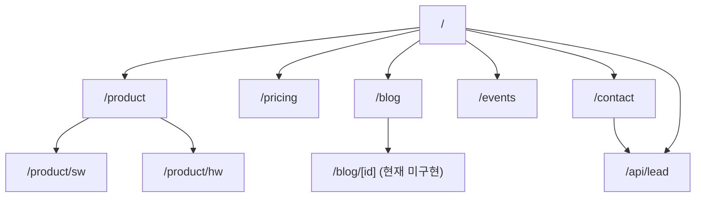

## 3. 전역 레이아웃 구조

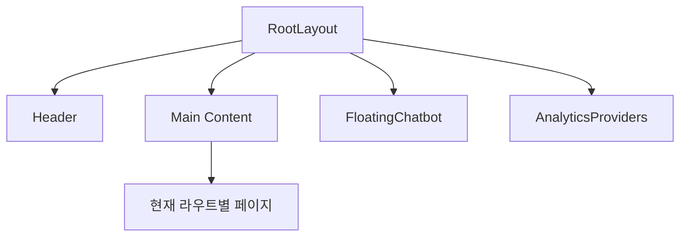

설명:

- 모든 페이지는 `RootLayout` 아래에 렌더된다
- `Header`, `FloatingChatbot`, `AnalyticsProviders` 는 전역 공통 요소다
- `Footer` 컴포넌트는 존재하지만 현재 전역 연결은 없다

## 4. 메인 랜딩 페이지 섹션 맵

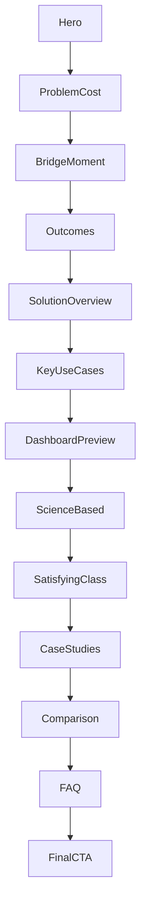

의미:

- 메인 랜딩은 전형적인 B2B 전환형 흐름을 가진다
- 구조상 “문제 인식 → 해결 방식 → 신뢰 근거 → 비교 → FAQ → 문의” 순서다

## 5. 제품 섹션 구조

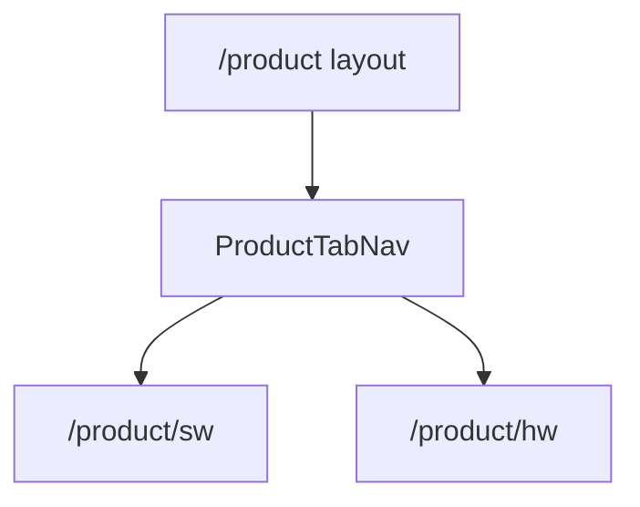

### 화면 역할

| 페이지 | 역할 | 현재 상태 |
| --- | --- | --- |
| `/product/sw` | 소프트웨어 가치 제안, 사례, UI 중심 설득 | 내용 많음, 파일 큼 |
| `/product/hw` | 하드웨어 제품군 소개 | CTA 실동작 보강 필요 |

## 6. 전환 퍼널

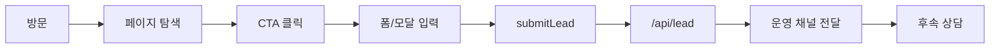

### 병목 가능 구간

1. CTA는 눌리지만 실제 액션이 없는 버튼
2. 폼 제출 성공처럼 보여도 실제 저장 안 되는 경우
3. 콘텐츠 페이지에서 전환으로 연결되지 않는 경우

## 7. 리드 수집 흐름

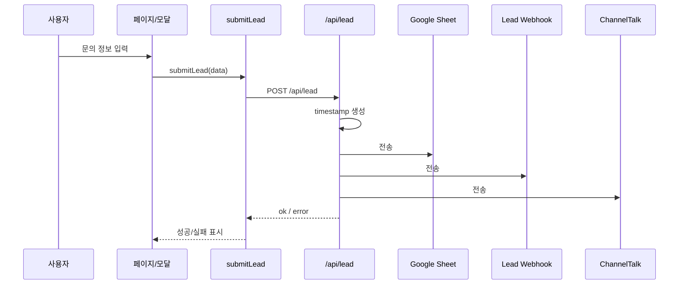

## 8. 분석 이벤트 흐름

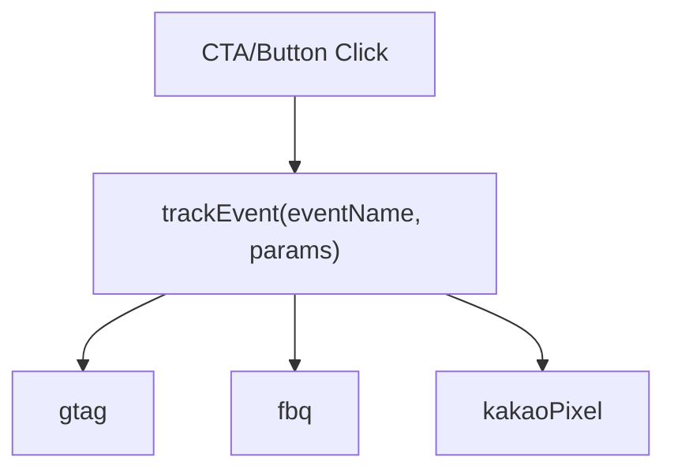

현재 주요 이벤트:

- `click_cta`
- `submit_demo_request`
- `download_materials`
- `view_demo_video`

## 9. 콘텐츠 운영 구조

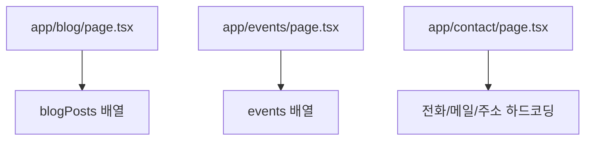

해석:

- 현재 콘텐츠 소스가 코드와 강하게 붙어 있다
- CMS 또는 별도 데이터 계층은 아직 없다

## 10. 화면별 CTA 맵

| 위치 | CTA | 현재 동작 |
| --- | --- | --- |
| Header | 자료 받아보기 | 이벤트 트래킹 중심 |
| Header | 도입 문의 | 데모 모달 |
| Hero | 제품 도입 문의 | 데모 모달 |
| Hero | 자료 받아보기 | 트래킹 중심 |
| Hero | 3분 투어 영상 | 트래킹 중심 |
| FinalCTA | 맞춤형 도입 플랜 받기 | 데모 모달 |
| FinalCTA | 서비스 소개서 다운로드 | 미구현에 가까움 |
| Product HW | 도입 문의하기 | 미구현에 가까움 |
| Contact | 문의 제출 | `/api/lead` 호출 |
| Blog Newsletter | 구독하기 | 현재 `alert` 중심 |

## 11. 페이지별 목적 맵

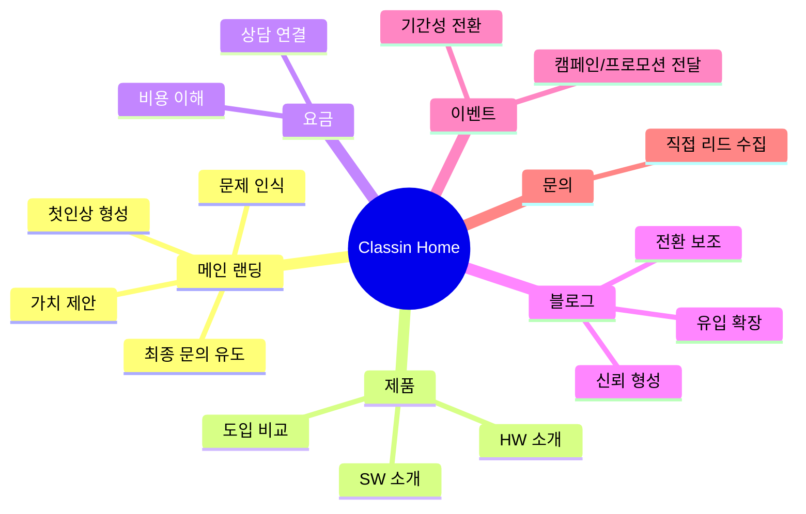

## 12. 운영 리스크 시각화

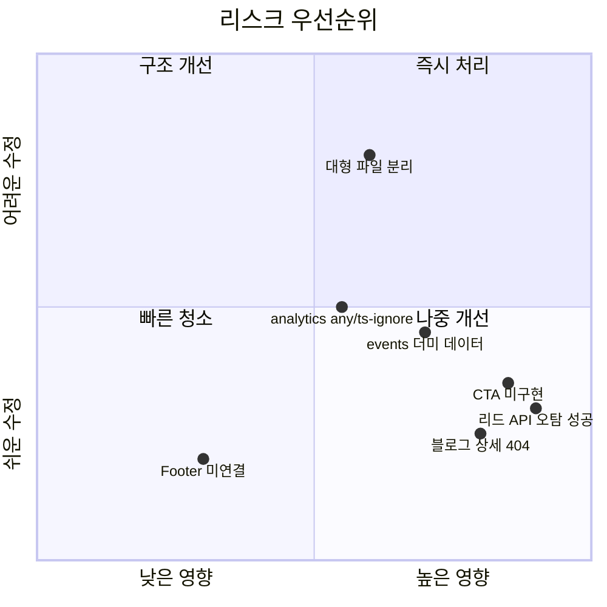

## 13. 구조 개선 방향 시각화

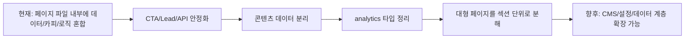

## 14. 추천 보는 순서

### 기획자가 볼 때

1. 사이트맵
2. 전환 퍼널
3. 화면별 CTA 맵
4. 운영 리스크 시각화

### 디자이너가 볼 때

1. 메인 랜딩 섹션 맵
2. 제품 섹션 구조
3. 페이지별 목적 맵

### 개발자가 볼 때

1. 전역 레이아웃 구조
2. 리드 수집 흐름
3. 분석 이벤트 흐름
4. 구조 개선 방향

## 15. 한 줄 요약

현재 `Classin Home`은 “메시지 전달형 랜딩”으로는 충분히 보이지만, 시각화 관점에서 보면 아직 “전환 제품”으로 완전히 닫히지 않은 지점들이 있다. 이 문서는 그 빈 구간을 빠르게 발견하기 위한 지도 역할을 한다.
