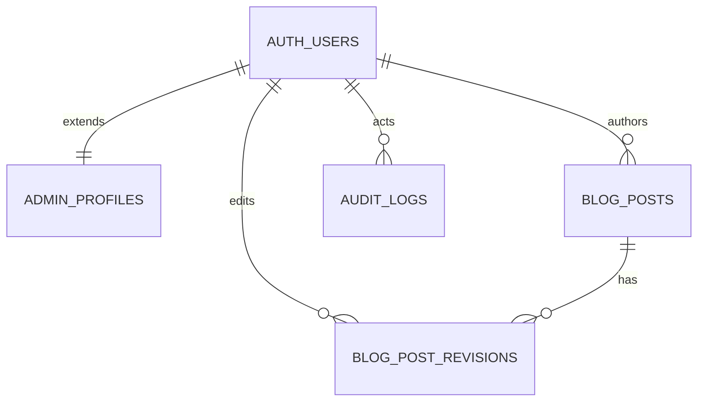

# Backend 2 설계: 관리자 전용 접근 + 블로그 CMS

기준 시점: 2026-03-20  
문서 목적: `Classin Home` 저장소에 아직 없는 관리자 전용 운영 구조와 블로그 글쓰기 백엔드 설계를 정의한다.  
적용 범위: 구현 전 설계 문서, 코드 반영 없음  
적용 가정: 인증과 DB는 Supabase Auth + Supabase Postgres를 사용한다.

## 1. 배경

현재 저장소는 공개 랜딩 사이트 중심 구조다.

- 공개 페이지: `/`, `/product/*`, `/pricing`, `/blog`, `/events`, `/contact`
- 운영 API: `/api/lead` 만 존재
- 블로그 데이터: `app/blog/page.tsx` 내부 하드코딩 배열
- 관리자 계정, 로그인, 권한, CMS, 감사 로그 구조는 아직 없음

즉, 지금은 "콘텐츠를 보여주는 프론트"는 있지만 "권한 있는 운영자가 안전하게 관리하는 백엔드"는 없는 상태다.

## 2. 설계 목표

이번 백엔드 2 설계의 목표는 아래와 같다.

1. 관리자나 권한 있는 내부 사용자만 운영 기능을 사용할 수 있어야 한다.
2. 공개 사이트와 운영 사이트의 접근 경계를 명확히 나눠야 한다.
3. 블로그 글 작성, 수정, 검토, 발행을 역할별로 통제할 수 있어야 한다.
4. 누가 무엇을 변경했는지 추적 가능한 감사 로그가 필요하다.
5. 현재 하드코딩된 블로그 데이터를 향후 DB 기반 CMS로 이전할 수 있어야 한다.

## 3. 비목표

이번 설계에서 바로 다루지 않는 범위는 아래와 같다.

- 일반 방문자 회원가입
- 유료 결제
- 외부 고객용 마이페이지
- 댓글, 좋아요, 공개 사용자 프로필
- 완전한 멀티테넌시

## 4. 핵심 원칙

### 4-1. 기본 차단

- 운영 기능은 기본적으로 모두 차단한다.
- 명시적으로 허용된 계정과 권한만 접근 가능하게 한다.

### 4-2. 공개/운영 분리

- 공개 영역과 운영 영역은 라우트, 인증, 권한 검사 기준을 분리한다.
- 공개 페이지는 인증 없이 접근 가능해야 한다.
- 운영 페이지는 인증과 권한 검사를 모두 통과해야 한다.

### 4-3. 서버 권한 검사

- 권한 검사는 클라이언트 UI 숨김만으로 끝내지 않는다.
- `middleware`, Route Handler, Server Action, DB 쓰기 경로에서 모두 검사한다.

### 4-4. 초대 기반 계정 발급

- 회원가입 페이지는 만들지 않는다.
- `SUPER_ADMIN` 또는 상위 운영자 초대로만 계정을 생성한다.
- 초대 발송은 Supabase Admin API를 통해 수행한다.

### 4-5. Managed vs Custom

Supabase를 쓰므로 아래처럼 책임을 분리한다.

- Supabase가 맡는 것
  - 인증 사용자 원장본
  - 세션 쿠키와 토큰 갱신
  - 이메일/비밀번호 로그인
  - 초대 링크 발송
- 애플리케이션이 맡는 것
  - 관리자 역할과 상태
  - 블로그 데이터
  - 감사 로그
  - 운영 화면 권한 가드

### 4-6. 추적 가능성

- 게시글 생성, 수정, 삭제, 발행, 권한 변경, 계정 정지 같은 민감 작업은 모두 로그에 남긴다.

## 5. 목표 구조

```text
Public Web
  /                         공개 랜딩
  /blog                     공개 블로그 목록
  /blog/[slug]              공개 블로그 상세
  /events                   공개 이벤트 목록

Admin Web
  /admin/login              관리자 로그인
  /admin                    관리자 대시보드
  /admin/posts              게시글 목록
  /admin/posts/new          게시글 작성
  /admin/posts/[id]         게시글 상세/미리보기
  /admin/posts/[id]/edit    게시글 수정
  /admin/users              계정/권한 관리
  /admin/audit-logs         감사 로그
  /admin/settings           운영 설정

Admin API
  /api/admin/auth/*
  /api/admin/posts/*
  /api/admin/users/*
  /api/admin/audit-logs
```

## 6. 인증/권한 모델

### 6-1. 계정 생성 방식

- 일반 회원가입 없음
- 초대 링크 기반 계정 생성
- 초대 토큰 만료 시간 포함
- 초대 수락 후 비밀번호 설정
- 이후 이메일 + 비밀번호 로그인

Supabase 기준:

- 운영자 초대는 서버에서 `supabase.auth.admin.inviteUserByEmail()` 사용
- 초대 메일 발송을 위해 운영 환경에서는 Custom SMTP 설정이 사실상 필수
- 기본 SMTP는 프로젝트 팀 주소만 발송 가능하고, 전송량 제한도 매우 낮다

추가 보안 옵션:

- 운영 초기: 이메일 + 비밀번호
- 운영 안정화 이후: TOTP 기반 2차 인증 추가 가능

### 6-2. 세션 방식

- Supabase Auth의 쿠키 기반 SSR 세션 사용
- Next.js App Router에서는 공식 `@supabase/ssr` 패턴을 사용
- 브라우저 쿠키와 토큰 갱신은 Supabase Auth가 관리
- 로그아웃은 Supabase Auth 세션 폐기로 처리

권장 이유:

- 관리자 영역은 브라우저 로컬 스토리지보다 쿠키 기반 SSR 구성이 안전하다
- Supabase 공식 Next.js 가이드와 자연스럽게 맞는다
- 계정/권한 테이블만 앱에서 관리하면 되므로 중복 구현이 줄어든다

구현 메모:

- V1에서는 별도의 `admin_sessions` 앱 테이블을 만들지 않는다
- 서버 전용 관리 작업만 `SUPABASE_SERVICE_ROLE_KEY` 사용
- `service_role` 키는 프론트에 절대 노출하지 않는다

### 6-3. 역할(Role)

초기 설계에서는 아래 4개 역할이면 충분하다.

| 역할 | 설명 |
| --- | --- |
| `SUPER_ADMIN` | 전체 권한, 계정/권한 관리 가능 |
| `ADMIN` | 블로그 포함 운영 기능 전반 관리 가능 |
| `EDITOR` | 게시글 작성/수정 가능, 발행은 불가 |
| `VIEWER` | 운영 화면 조회만 가능, 수정 불가 |

### 6-4. 권한(Permission)

역할은 아래 권한 묶음으로 해석한다.

| Permission | SUPER_ADMIN | ADMIN | EDITOR | VIEWER |
| --- | --- | --- | --- | --- |
| `dashboard.read` | O | O | O | O |
| `post.read` | O | O | O | O |
| `post.create` | O | O | O | X |
| `post.update` | O | O | O | X |
| `post.delete` | O | O | X | X |
| `post.submit_review` | O | O | O | X |
| `post.publish` | O | O | X | X |
| `post.unpublish` | O | O | X | X |
| `user.read` | O | O | X | X |
| `user.invite` | O | X | X | X |
| `user.role.update` | O | X | X | X |
| `audit.read` | O | O | X | X |

정책:

- 초기 구현은 `role enum -> permission map` 방식으로 단순하게 간다.
- 커스텀 권한 조합이 필요해지면 이후 `roles`, `permissions`, `role_permissions` 구조로 확장한다.

## 7. 블로그 운영 플로우

### 7-1. 게시글 상태

| 상태 | 설명 |
| --- | --- |
| `DRAFT` | 작성 중 |
| `IN_REVIEW` | 검토 요청됨 |
| `PUBLISHED` | 공개 발행됨 |
| `ARCHIVED` | 운영상 보관 |

필요 시 추후 추가 가능:

- `SCHEDULED`
- `REJECTED`

### 7-2. 권한별 흐름

1. `EDITOR` 가 글을 작성하고 `DRAFT` 로 저장한다.
2. `EDITOR` 또는 `ADMIN` 이 검토 요청하여 `IN_REVIEW` 로 변경한다.
3. `ADMIN` 이 승인 후 `PUBLISHED` 로 전환한다.
4. 수정이 필요하면 다시 `DRAFT` 또는 `IN_REVIEW` 로 되돌린다.
5. 더 이상 노출하지 않을 글은 `ARCHIVED` 로 이동한다.

### 7-3. 공개 반영 규칙

- 공개 `/blog` 와 `/blog/[slug]` 는 `PUBLISHED` 상태만 노출한다.
- `DRAFT`, `IN_REVIEW`, `ARCHIVED` 는 관리자 화면에서만 보인다.
- 슬러그는 발행 전 중복 검사를 통과해야 한다.

## 8. 라우트 설계

### 8-1. 공개 라우트

| 경로 | 접근 | 설명 |
| --- | --- | --- |
| `/blog` | Public | 발행된 게시글 목록 |
| `/blog/[slug]` | Public | 발행된 게시글 상세 |

### 8-2. 관리자 라우트

| 경로 | 접근 | 설명 |
| --- | --- | --- |
| `/admin/login` | Public | 관리자 로그인 |
| `/admin` | Authenticated | 운영 요약 대시보드 |
| `/admin/posts` | `post.read` | 게시글 목록/필터 |
| `/admin/posts/new` | `post.create` | 새 게시글 작성 |
| `/admin/posts/[id]` | `post.read` | 게시글 상세/미리보기 |
| `/admin/posts/[id]/edit` | `post.update` | 게시글 수정 |
| `/admin/users` | `user.read` | 계정 목록/상태 |
| `/admin/audit-logs` | `audit.read` | 감사 로그 조회 |
| `/admin/settings` | `ADMIN` 이상 | 운영 설정 |

### 8-3. 접근 제어 방식

- `middleware` 에서 `/admin/**`, `/api/admin/**` 요청 시 로그인 여부 1차 확인
- 서버에서 `requireSession()`, `requirePermission()` 재확인
- UI 버튼 숨김은 보조 수단으로만 사용

## 9. 데이터 모델

초기 구현은 아래 테이블 구성이 적절하다.

### 9-1. `auth.users` (Supabase 관리)

| 컬럼 | 타입 | 설명 |
| --- | --- | --- |
| `id` | uuid | PK |
| `email` | string | 로그인 이메일 |
| `encrypted_password` | string | Supabase 내부 관리 |
| `email_confirmed_at` | datetime nullable | 이메일 확인 시각 |
| `last_sign_in_at` | datetime nullable | 마지막 로그인 |
| `created_at` | datetime | 생성 시각 |

설계 메모:

- 비밀번호 해시와 인증 상태는 `auth.users`를 원장본으로 사용한다
- 앱은 이 테이블을 직접 대체하거나 중복 보관하지 않는다

### 9-2. `admin_profiles`

| 컬럼 | 타입 | 설명 |
| --- | --- | --- |
| `user_id` | uuid | PK, `auth.users.id` FK |
| `display_name` | string | 관리자 표시 이름 |
| `role` | enum | `SUPER_ADMIN`, `ADMIN`, `EDITOR`, `VIEWER` |
| `status` | enum | `INVITED`, `ACTIVE`, `SUSPENDED` |
| `invited_by` | uuid nullable | 초대한 사용자 |
| `last_login_at` | datetime nullable | 앱 기준 마지막 로그인 |
| `created_at` | datetime | 생성 시각 |
| `updated_at` | datetime | 수정 시각 |

설계 메모:

- 운영 권한은 `admin_profiles`를 기준으로 판정한다
- 이메일은 `auth.users`를 원장본으로 두고, `admin_profiles`에서는 중복 저장하지 않는 것을 기본으로 한다

### 9-3. `blog_posts`

| 컬럼 | 타입 | 설명 |
| --- | --- | --- |
| `id` | uuid | PK |
| `title` | string | 게시글 제목 |
| `slug` | string unique | 공개 URL 식별자 |
| `excerpt` | string | 목록용 요약 |
| `content_json` | json | 에디터 원본 데이터 |
| `content_html` | text | 렌더링용 HTML 캐시 |
| `thumbnail_url` | string nullable | 대표 이미지 |
| `category` | string | 카테고리 |
| `tag` | string nullable | 태그 |
| `author_user_id` | uuid | 작성자, `auth.users.id` FK |
| `status` | enum | `DRAFT`, `IN_REVIEW`, `PUBLISHED`, `ARCHIVED` |
| `published_at` | datetime nullable | 발행 시각 |
| `published_by_user_id` | uuid nullable | 발행자, `auth.users.id` FK |
| `created_at` | datetime | 생성 시각 |
| `updated_at` | datetime | 수정 시각 |

설계 메모:

- 초기에는 `content_json` + `content_html` 이중 저장이 실용적이다.
- 추후 Markdown 기반으로 바꾸더라도 컬럼만 조정하면 된다.

### 9-4. `blog_post_revisions`

| 컬럼 | 타입 | 설명 |
| --- | --- | --- |
| `id` | uuid | PK |
| `post_id` | uuid | `blog_posts.id` FK |
| `title` | string | 당시 제목 |
| `excerpt` | string | 당시 요약 |
| `content_json` | json | 당시 본문 |
| `status` | enum | 당시 상태 |
| `edited_by_user_id` | uuid | 수정자, `auth.users.id` FK |
| `created_at` | datetime | 수정 시각 |

목적:

- 이전 버전 복구
- 검수 이력 비교
- 사고 대응

### 9-5. `audit_logs`

| 컬럼 | 타입 | 설명 |
| --- | --- | --- |
| `id` | uuid | PK |
| `actor_user_id` | uuid | 행위 주체, `auth.users.id` FK |
| `action` | string | 예: `post.publish`, `user.suspend` |
| `target_type` | string | 예: `blog_post`, `admin_user` |
| `target_id` | uuid | 대상 PK |
| `payload_json` | json | 변경 전후 핵심 데이터 |
| `created_at` | datetime | 기록 시각 |

### 9-6. 선택: `admin_invitation_logs`

이 테이블은 필수는 아니다.

필요한 경우에만 아래 목적으로 추가한다.

- 누가 누구를 언제 초대했는지 앱 내부에서 별도 조회
- 초대 이력 대시보드 제공
- 운영 감사 보강

V1에서는 Supabase Auth 초대 기능과 `audit_logs`만으로도 충분하므로 생략 가능하다.

## 10. 관계 요약



## 11. API 설계

### 11-1. 인증

기본 원칙:

- 로그인과 로그아웃은 Supabase Auth SDK를 우선 사용한다
- 커스텀 세션 발급 API는 만들지 않는다
- 관리자 초대처럼 `service_role` 키가 필요한 작업만 서버 Route Handler 또는 Server Action으로 감싼다

| 작업 | 구현 방식 | 비고 |
| --- | --- | --- |
| 로그인 | `supabase.auth.signInWithPassword()` | 관리자 로그인 화면 |
| 로그아웃 | `supabase.auth.signOut()` | 관리자 세션 종료 |
| 현재 사용자 조회 | `supabase.auth.getUser()` | 서버에서 권한 판정 전 사용 |
| 초대 발송 | `supabase.auth.admin.inviteUserByEmail()` | 서버 전용, `service_role` 필요 |

### 11-2. 계정/권한

| 메서드 | 경로 | 설명 | 권한 |
| --- | --- | --- | --- |
| `GET` | `/api/admin/users` | `admin_profiles` 목록 조회 | `user.read` |
| `POST` | `/api/admin/users/invitations` | 운영자 초대 + `admin_profiles` 생성 | `user.invite` |
| `PATCH` | `/api/admin/users/:id/role` | 역할 변경 | `user.role.update` |
| `PATCH` | `/api/admin/users/:id/status` | 활성/정지 처리 | `user.role.update` |

### 11-3. 게시글

| 메서드 | 경로 | 설명 | 권한 |
| --- | --- | --- | --- |
| `GET` | `/api/admin/posts` | 게시글 목록 조회 | `post.read` |
| `POST` | `/api/admin/posts` | 새 게시글 작성 | `post.create` |
| `GET` | `/api/admin/posts/:id` | 게시글 상세 조회 | `post.read` |
| `PATCH` | `/api/admin/posts/:id` | 게시글 수정 | `post.update` |
| `DELETE` | `/api/admin/posts/:id` | 게시글 삭제 | `post.delete` |
| `POST` | `/api/admin/posts/:id/submit-review` | 검토 요청 | `post.submit_review` |
| `POST` | `/api/admin/posts/:id/publish` | 게시글 발행 | `post.publish` |
| `POST` | `/api/admin/posts/:id/unpublish` | 발행 해제 | `post.unpublish` |

### 11-4. 로그

| 메서드 | 경로 | 설명 | 권한 |
| --- | --- | --- | --- |
| `GET` | `/api/admin/audit-logs` | 감사 로그 목록 조회 | `audit.read` |

## 12. 서버 레이어 설계

### 12-1. 권장 디렉터리 초안

```text
app/
  admin/
    login/page.tsx
    page.tsx
    posts/
      page.tsx
      new/page.tsx
      [id]/page.tsx
      [id]/edit/page.tsx
    users/page.tsx
    audit-logs/page.tsx
  api/
    admin/
      auth/
      posts/
      users/
      audit-logs/

lib/
  supabase/
    browser.ts
    server.ts
    middleware.ts
  auth/
    permissions.ts
    guards.ts
  blog/
    repository.ts
    validators.ts
  audit/
    log.ts
```

### 12-2. 공통 가드 함수

필수 유틸:

- `requireSession()`
- `requireRole(...roles)`
- `requirePermission(permission)`
- `assertPostEditable(user, post)`
- `getAdminProfile(userId)`

원칙:

- 모든 쓰기 API는 `requirePermission()` 선행
- 게시글 수정 시 역할뿐 아니라 상태 정책도 함께 검증
- Supabase `auth.users`만 믿고 끝내지 않고, 반드시 `admin_profiles.status`도 함께 확인

예:

- `EDITOR` 는 `PUBLISHED` 글 직접 발행 불가
- `VIEWER` 는 어떤 쓰기 작업도 불가

## 13. 공개 블로그 전환 설계

현재 `app/blog/page.tsx` 는 하드코딩 배열을 사용한다.  
목표 상태는 아래와 같다.

### 현재

- `blogPosts` 배열을 클라이언트 컴포넌트 내부에 직접 선언
- `/blog/[id]` 링크가 있지만 실제 상세 라우트 없음

### 목표

- `/blog` 는 `blog_posts` 의 `PUBLISHED` 데이터만 조회
- `/blog/[slug]` 상세 라우트 추가
- 관리자 작성 화면에서 생성한 글만 공개 영역으로 반영

### 전환 단계

1. DB 테이블과 관리자 CRUD를 먼저 만든다.
2. 기존 하드코딩 데이터를 시드 데이터로 이관한다.
3. 공개 목록 페이지를 DB 조회 구조로 전환한다.
4. `/blog/[slug]` 상세 페이지를 추가한다.
5. 하드코딩 배열을 제거한다.

## 14. 보안 요구사항

### 필수

- RLS 적용 또는 `private` 스키마 사용
- CSRF 방어
- 로그인 시도 제한
- 민감 API에 대한 서버 권한 검사
- 감사 로그 기록
- 운영 메일 발송용 Custom SMTP 설정
- `service_role` 키 서버 보관

Supabase 기준 메모:

- `public` 스키마 테이블은 Data API에 노출될 수 있으므로 RLS를 기본값으로 본다
- 내부 전용 로그성 데이터는 `private` 스키마로 두는 것도 권장된다

### 권장

- 2FA
- 관리자 IP 허용 목록
- 계정 잠금 정책
- 비정상 로그인 알림

## 15. 운영 규칙

### 계정

- 최초 `SUPER_ADMIN` 1명만 수동 생성
- 이후 계정 생성은 초대만 허용
- 퇴사/권한 해제 시 `SUSPENDED` 처리

### 게시글

- 공개 반영은 `ADMIN` 이상만 가능
- 발행 시 `slug` 중복 검사 필수
- 삭제는 소프트 삭제 대신 `ARCHIVED` 우선 권장

### 로그

- 최소 6개월 이상 감사 로그 보관 권장
- 계정/권한/발행 행위는 로그 필수

## 16. 구현 우선순위

### Phase 1

- Supabase 프로젝트 생성
- `@supabase/supabase-js`, `@supabase/ssr` 연결
- 환경변수 설정
- 관리자 로그인
- 역할 기반 접근 제어
- `/admin` 기본 골격

### Phase 2

- `auth.users` + `admin_profiles` 연결
- 운영자 초대 플로우
- 게시글 CRUD
- 게시글 상태 전이
- 감사 로그 기록

### Phase 3

- 공개 블로그 DB 연동
- `/blog/[slug]` 상세 페이지
- 계정 관리 화면
- 썸네일용 Supabase Storage 도입 여부 결정

### Phase 4

- 2FA
- 스케줄 발행
- 리비전 비교 UI

## 17. Supabase 연결 시 필요한 것

### 필수

- Supabase 프로젝트
- Next.js용 Supabase SSR 클라이언트 설정
- `NEXT_PUBLIC_SUPABASE_URL`
- `NEXT_PUBLIC_SUPABASE_PUBLISHABLE_KEY`
- `SUPABASE_SERVICE_ROLE_KEY`
- Auth Redirect URL 설정
- Custom SMTP
- `admin_profiles` 테이블
- `blog_posts` 테이블
- 관리자 1명 초기 생성
- `/admin/**` 가드

### 추천

- `audit_logs` 테이블
- `blog_post_revisions` 테이블
- `private` 스키마 사용 여부 검토
- Supabase 타입 생성

## 18. Supabase 연결 시 당장 스킵 가능한 것

### V1에서 스킵 가능

- 커스텀 비밀번호 해시 저장
- 커스텀 세션 테이블
- 커스텀 초대 토큰 테이블
- 세분화된 `roles / permissions / role_permissions` 3중 테이블
- 소셜 로그인
- MFA
- Realtime
- Edge Functions
- 리비전 비교 UI
- 예약 발행

### 조건부 스킵

- Supabase Storage
  - 초기엔 썸네일을 `public/` 정적 파일로 써도 됨
- `blog_post_revisions`
  - 운영 속도를 우선하면 나중으로 미뤄도 됨
- `audit_logs` 조회 UI
  - 로그 적재만 먼저 하고 화면은 뒤로 미룰 수 있음

## 19. 이번 설계의 결론

이 프로젝트의 운영 기능은 "아무나 로그인 가능한 서비스"보다 "초대받은 내부 운영자만 접근 가능한 관리자 시스템"으로 설계하는 것이 맞다.

권장 결론은 아래와 같다.

- 공개 사이트와 관리자 사이트를 라우트 기준으로 분리한다.
- 일반 회원가입 없이 Supabase 초대 기반 관리자 계정만 운영한다.
- 역할은 `SUPER_ADMIN`, `ADMIN`, `EDITOR`, `VIEWER` 로 시작한다.
- 블로그는 `DRAFT -> IN_REVIEW -> PUBLISHED -> ARCHIVED` 상태 머신으로 관리한다.
- 모든 운영 기능은 서버 권한 검사와 감사 로그를 기본값으로 둔다.
- 인증과 세션은 Supabase에 맡기고, 앱은 역할/상태/콘텐츠/로그에 집중한다.

이 문서를 기준으로 다음 단계에서는 실제 구현용 작업을 아래 순서로 쪼개면 된다.

1. Supabase 클라이언트 연결
2. `admin_profiles` + 권한 가드
3. 관리자 라우트 뼈대
4. 블로그 CMS CRUD
5. 공개 블로그 연동
